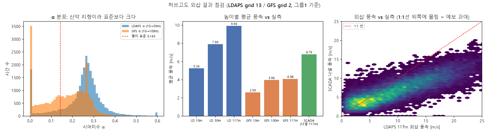
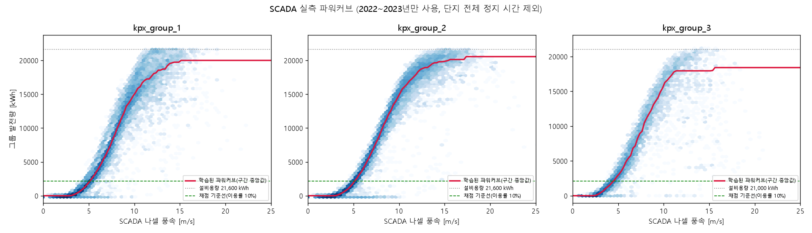
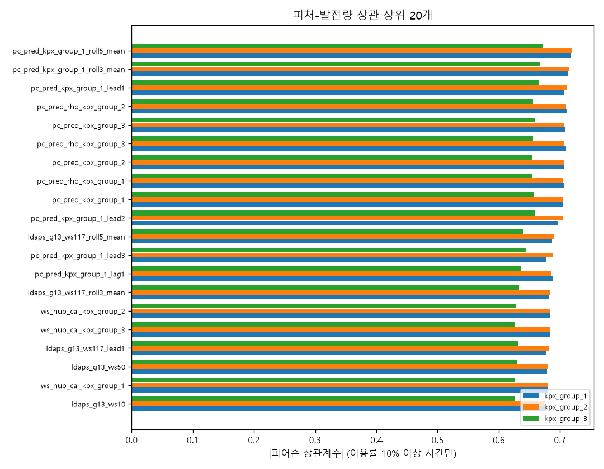

# Phase 2. 피처 엔지니어링 — `03_features.ipynb`

원본 기상 예보 800개 컬럼을 **발전량과 물리적으로 직결되는 179개 피처**로 바꾼 작업 기록이다.

---

## 1. 왜 (Why) — 이유와 근거

### 1-1. 원본 예보값은 그대로 모델에 넣을 수 없다

`01_preprocessing.ipynb`가 만든 `train_merged.parquet`는 26,304행 × 800열이다. 그런데 이 800열의 대부분은
**바람의 x·y 성분(u, v)** 처럼 그 자체로는 발전량과 연결되지 않는 값이다.

예를 들어 `heightAboveGround_10_10u = 3.0`이라는 숫자만 봐서는 바람이 센지 약한지 알 수 없다.
같은 시각의 `10v = 8.0`을 함께 봐야 실제 풍속이 `sqrt(3² + 8²) = 8.5 m/s`인 꽤 센 바람임을 알 수 있다.
모델에게 "이 두 숫자를 제곱해서 더하고 루트를 씌워라"를 스스로 알아내게 하는 것은 낭비다. 사람이 먼저 계산해서 준다.

### 1-2. 출발점이 된 Phase 1(EDA)의 발견 4가지

이 노트북의 모든 설계 판단은 `reports/phase1_eda.md`에서 확인한 사실에서 나왔다.

| # | Phase 1에서 확인한 것 | Phase 2에서 한 일 |
|---|---|---|
| 1 | 허브고도에 가까운 예보일수록 실측과 잘 맞는다 (GFS: 10m 0.54 < 100m 0.59 / LDAPS: 50m 0.77 > 5m 0.44) | 허브고도(117m)로 멱법칙 외삽하는 피처를 만듦 (§2-4) |
| 2 | 최고 상관 격자(LDAPS 13, GFS 2)가 최근접 격자(LDAPS 5·6·12, GFS 5)와 **다르다** | 대표 격자를 "최근접 + 최고상관" 둘 다 넣고, 전체 격자 집계도 병행 (§2-3) |
| 3 | SCADA 발전량에 센서 이상치가 있다 (정격의 만 배, 부호 반전 쌍) | 파워커브 학습 전에 반드시 필터링 (§2-7) |
| 4 | 겨울(1·2·12월)에 "바람은 부는데 출력 0"인 시간이 몰려 있다 | 결빙(icing) 위험 점수 피처를 만듦 (§2-6) |

### 1-3. 문헌 근거 (CLAUDE.md 13번)

- **출력은 풍속의 세제곱에 비례** (`P = ½ρAv³`). 풍속을 10% 틀리면 발전량은 33% 틀린다 → 높이 보정이 필수.
- **공기 밀도 보정**: `ρ = p/(R_d·T_v)`. 고지대·겨울철에 밀도 효과가 크다.
- **파워커브 하이브리드가 강함**: NWP 풍속 → (SCADA로 학습한) 파워커브 → 물리 예측치를 만들고,
  ML이 잔차를 학습하는 구조가 순수 ML보다 안정적이라는 보고가 다수.
- **NWP 다중 소스**: LDAPS와 GFS를 함께 쓰면 개선되며, **두 모델의 풍속 차이 자체가 불확실성 피처**가 된다.
- **결빙 손실**: 겨울철 0°C 부근 + 고습 조건에서 출력 급감.

> 위 항목들은 CLAUDE.md 13번이 정리한 도메인 지식이다. 작업을 마친 뒤 **각 피처의 근거를 다시 검증**해
> §2-11에 4등급으로 분류했고, 웹 검색으로 확인한 원 문헌과 추가 후보 피처는 §4-5와 문서 끝 **참고문헌**에 정리했다.

### 1-4. 대회 산식이 강제하는 것 (CLAUDE.md 5번)

채점은 **이용률(발전량/설비용량) 10% 이상 시간만** 대상이다. 그래서 이 문서의 모든 상관·오차 수치는
그 구간에서만 계산했다. 저풍속 시간을 포함하면 상관이 부풀려 보여서 판단을 그르친다.

---

## 2. 어떻게 (How) — 과정

노트북은 마크다운 20개 + 코드 22개, 총 42개 셀이다. 아래 각 소절이 노트북의 한 단계(또는 한 판단)에 대응한다.

### 2-1. 전처리 캐시 로딩 (셀 4)

`data/processed/`의 parquet 4개만 읽는다. 원본 CSV는 다시 읽지 않는다(격자 좌표만 예외, §2-3).

| 파일 | shape |
|---|---|
| `train_merged.parquet` | 26,304 × 800 |
| `test_merged.parquet` | 8,760 × 797 (라벨 3개가 없어서 3열 적다) |
| `scada_vestas_hourly.parquet` | 26,304 × 38 |
| `scada_unison_hourly.parquet` | 17,544 × 17 |

> **작업 중 발견**: `data/`는 `.gitignore` 대상이라 다른 PC에서 clone하면 `data/processed/`가 비어 있다.
> `01_preprocessing.ipynb`를 Restart & Run All로 다시 돌려 캐시를 복구한 뒤 이 노트북을 실행했다.
> 두 노트북 모두 처음부터 끝까지 오류 없이 재실행됨을 확인했다(CLAUDE.md 12번 재현성 요건).

### 2-2. 예보 리드타임 확인 — "lag/lead 피처를 써도 되는가"의 근거 (셀 6)

`data_available_kst_dtm`(예보를 실제로 쓸 수 있게 된 시각)과 `forecast_kst_dtm`(예보가 가리키는 시각)의
차이를 확인했다. **train과 test 모두 완전히 동일한 구조**였다:

- 예보 공개 시각은 **전날 13:00 딱 하나** (다른 시각 없음)
- 한 번의 발표가 **24개 시각**(다음날 01:00 ~ 그다음날 00:00)을 통째로 담는다
- 리드타임은 **12~35시간**

**이게 왜 중요한가**: "내일 15시를 예측할 때 내일 16시의 **예보값**"은 어제 13시에 이미 받아 둔 같은 파일 안에 있다.
따라서 **예보값의 lead(미래 시각) 피처는 누수가 아니다** (실측값의 lead였다면 명백한 누수). 이 확인이 §2-8의 근거다.
CLAUDE.md 4번 규칙("데이터가 실제로 활용 가능해진 시각 기준")을 코드로 검증한 것이다.

### 2-3. 대표 격자 선정 (셀 8)

LDAPS 16개 / GFS 9개 격자를 전부 개별 컬럼으로 쓰면 컬럼이 폭발한다. 두 기준을 합쳐 대표 격자를 골랐다.

- **최근접 격자**: `info.xlsx`의 터빈 좌표(도-분-초 문자열)를 십진수로 변환 → 그룹별 중심점 → 하버사인 거리 최소.
  코드로 다시 계산해 LDAPS `[5, 6, 12]`, GFS `[5, 5, 5]`를 얻었다(Phase 1과 일치).
- **최고상관 격자**: `reports/phase1_eda.md` §2-8에서 SCADA 실측 풍속과 상관이 가장 높았던 LDAPS 13, GFS 2.

→ **LDAPS 대표 격자 `[5, 6, 12, 13]`, GFS 대표 격자 `[2, 5]`**

**선택과 이유**: "가장 가까운 격자"와 "가장 비슷하게 부는 격자"가 다르다는 것 자체가 정보다.
산악 지형에서는 바람이 지형을 타고 흐르므로 최단거리가 최적이 아닐 수 있다.
그래서 하나를 고르지 않고 **둘 다 넣고, 추가로 16개(9개) 전체의 평균·표준편차도 피처로 만들었다**.
격자간 표준편차는 "이 지역 안에서도 예보가 서로 갈린다" = **공간 불확실성**을 뜻한다.

**공기 밀도용 격자는 최근접 `[5, 6, 12]`만 사용**했다. LDAPS 격자별 지형고도(`surface_0_h`)가 868~1001m로
제각각이라, 먼 격자를 섞으면 기압(고도의 함수)이 실제 단지 조건에서 벗어나기 때문이다.

### 2-4. 허브고도(117m) 풍속 외삽 (셀 10~12, 14)

**문제**: 터빈 허브는 지상 117m인데, 예보는 LDAPS 10m·50m, GFS 10m·80m·100m만 준다.

**멱법칙(power law)**:

```
ws(z₂) = ws(z₁) × (z₂/z₁)^α
α = ln(ws_high / ws_low) / ln(z_high / z_low)
```

α(시어지수)는 지표가 거칠수록 크다(바다 ≈0.10, 평지 ≈0.14, 산악 ≈0.20~0.30).
**책값을 쓰지 않고 시각마다 예보 데이터에서 직접 역산**했다. 이러면 α 자체가 "그 시각의 대기 안정도"를
담은 피처가 된다(밤에 안정되면 위아래가 안 섞여 α가 커지고, 낮에 대류가 활발하면 작아진다).

측정 결과 LDAPS α의 중앙값은 **0.262**로 평지 표준(0.143)보다 확실히 크다 — 산악 거친 지형과 부합한다.

**외삽 기준 높이 선택**: 배율이 클수록 α 오차가 증폭되므로 허브에 가까운 높이를 기준으로 삼았다.

| 기준 높이 | 117m까지 배율(α=0.262) | 배율 범위(α=0~0.6) |
|---|---:|---|
| LDAPS 10m | ×1.905 | ×1.000 ~ ×4.374 |
| **LDAPS 50m (채택)** | ×1.249 | ×1.000 ~ ×1.665 |
| **GFS 100m (채택)** | ×1.042 | ×1.000 ~ ×1.099 |

α는 `[0, 0.6]`으로 자르고(음수 시어·과도 외삽 방지), 풍속이 0.5 m/s 미만이면 로그 비율이 불안정해지므로
기본값 0.262로 대체했다.

#### 여기서 발견한 함정 — LDAPS 50m 컬럼의 정체

LDAPS 50m 바람은 `50MUmax`, `50MUmin`, `50MVmax`, `50MVmin` 네 개다. 이름만 보면 "그 시간의 최대/최소 풍속"
같지만, **실제로는 u 성분과 v 성분 각각의 최댓값·최솟값**이다. 데이터로 확인했다:

- `50MUmax ≥ 50MUmin`이 **100%** 성립 (성분별 극값이므로 당연)
- 반면 `hypot(Umax,Vmax) ≥ hypot(Umin,Vmin)`은 **73%만** 성립 → "최대 성분끼리 묶은 것"은 풍속의 최댓값이 아니다

**Phase 1이 보고한 +1.04~2.25 m/s 양의 편향의 정확한 원인이 이것이다.** `hypot(Umax, Vmax)`를 50m 풍속으로
쓰면 구조적으로 과대평가된다.

**내린 선택**: 성분별 중간값을 먼저 만들고 나서 풍속을 구한다.

```
u50 = (Umax + Umin)/2,  v50 = (Vmax + Vmin)/2,  ws50 = hypot(u50, v50)
```

| 방식 | SCADA 상관 | SCADA 대비 편향 |
|---|---:|---:|
| `hypot(Umax, Vmax)` (Phase 1이 쓴 방식) | 0.8405 | +2.25 m/s |
| **`hypot(u50중간값, v50중간값)` (채택)** | **0.8410** | **+1.11 m/s** |

상관은 그대로 두고 편향만 절반으로 줄였다. 명백한 개선이다.

**버리지 않고 살린 것**: `hypot(Umax-Umin, Vmax-Vmin)`는 **그 1시간 동안 바람 벡터가 출렁인 폭**이다.
버리는 대신 `ws50_range`라는 **난류 강도 피처**로 썼다. 난류가 세면 같은 평균 풍속이라도 발전 효율이 떨어진다.

### 2-5. 공기 밀도 (셀 18~19)

출력은 밀도에 1차 비례한다. 겨울 -10°C와 여름 30°C의 밀도 차이는 **약 15%** — 같은 바람에도 발전량이 15% 다르다.

```
ρ = p / (R_d · T_v),   T_v = T(1 + 0.608·q)      [이상기체 상태방정식]
p_hub = p_surface · exp(-g·Δz / (R_d·T_v))       [정역학 평형, Δz = 117 - 2 = 115m]
T_hub = T_2m - 0.0065 × Δz                       [표준 기온감률]
```

`T_v`(가온도)는 "수증기가 섞이면 공기가 **가벼워진다**"는 사실을 기온을 살짝 올려 흉내내는 보정값이다
(직관에 반하지만, 수증기 분자 H₂O(18)가 질소·산소(28·32)보다 가볍다).

검산 결과 (기압 900hPa, 비습 0.005 — 태백 조건):

| 조건 | ρ [kg/m³] | 표준(1.225) 대비 | 등가풍속 배율 |
|---|---:|---:|---:|
| 한겨울 -10°C | 1.1879 | -3.0% | ×0.9898 |
| 봄가을 15°C | 1.0848 | -11.4% | ×0.9603 |
| 한여름 30°C | 1.0311 | -15.8% | ×0.9442 |

태백은 해발 900~1000m라 **어느 계절이든 표준 밀도보다 낮다**(기압이 낮아서). 그만큼 같은 풍속에서 발전량이 적다.

**밀도 보정 풍속** (IEC 61400-12-1 국제표준):

```
ws_corr = ws × (ρ / 1.225)^(1/3)
```

세제곱근인 이유: 출력이 `ρ·v³`에 비례하므로, 밀도 변화를 "같은 출력을 내는 등가 풍속"으로 환산하면 세제곱근이 된다.
이러면 **표준 밀도 기준의 파워커브 하나로 모든 계절을 다룰 수 있다.**

### 2-6. 대기 안정도·결빙·시간 (셀 20~21)

**안정도/난류**: 경계층 높이 `blh`(LDAPS), 환기율 `VRATE`(GFS), 시어 `ws117 - ws10`,
상하층 기온차 `t850 - t500`, 돌풍계수 `gust/ws10`, `ws50_range`.

`blh_below_hub`는 "경계층이 허브(117m)보다 얕은가"를 나타내는 플래그다. 얕으면 터빈 날개가
**경계층 위의 다른 바람**을 맞는다 → 지상 예보가 어긋나기 쉬운 조건이다.

**결빙 점수**: 착빙은 **과냉각 물방울**(0°C 아래인데 얼지 않은 물방울)이 날개에 부딪혀 얼면서 생긴다.
너무 따뜻하면 안 얼고, 너무 추우면(-15°C 이하) 공기 중 수분이 이미 얼음 결정이라 잘 안 붙는다.
가장 위험한 온도는 약 **-3°C**다. 0/1 플래그보다 정보량이 많은 **연속 점수**로 만들었다:

```
icing_score = exp(-((T - (-3))/4)²) × clip((RH - 80)/20, 0, 1)
```

검산:

| 기온 | 습도 | icing_score | 해석 |
|---:|---:|---:|---|
| -3°C | 98% | 0.900 | 가장 위험 (과냉각 안개) |
| -3°C | 70% | 0.000 | 춥지만 건조 → 안전 |
| 5°C | 98% | 0.016 | 습하지만 따뜻 → 안전 |
| -20°C | 98% | 0.000 | 너무 추움 → 안전 |
| 0°C | 92% | 0.342 | 위험 |

> LDAPS 상대습도는 과포화를 허용해 **110%까지** 나온다. 100%로 잘라서 썼다.

**시간 인코딩**: 23시와 0시는 실제로 1시간 차이인데 숫자로는 23 차이다. `sin`/`cos`로 원 위에 올려 이웃으로 만든다.
`hour`, `month`, `dayofyear` 각각에 적용했다.

### 2-7. SCADA로 배우는 두 가지 — 누수를 막는 설계 (셀 22~30)

여기서부터는 **SCADA 실측치로 "규칙"을 학습**한다. 앞 절과 결정적으로 다르므로 누수 설계가 필요하다.

#### 지킨 규칙 (CLAUDE.md 4번)

1. **SCADA는 test 기간(2025년)에 없다.** 그러므로 SCADA 값을 피처로 직접 넣지 않는다.
   train에서 배운 **규칙(회귀계수, 파워커브 표)만 test에 적용**한다 (CLAUDE.md 4번 허용 용법 (b), (c)).
2. **fit 기간을 2022-01-01 ~ 2023-12-31로 못박았다.** 2024년은 홀드아웃 검증용이다.
   2024년 SCADA까지 써서 파워커브를 만들면 2024 검증 점수에 2024 정보가 녹아들어
   **검증 점수가 실제보다 좋게 나와 우리 자신을 속인다.**
3. 파워커브는 터빈의 물리적 성질이라 거의 변하지 않는다. 2년(약 17,000시간)이면 충분히 안정적으로 추정된다.
   즉 이 제한으로 잃는 것은 거의 없고, 얻는 것(정직한 검증 점수)이 훨씬 크다.

#### SCADA 유효성 판정

Phase 1에서 발견한 센서 이상치를 걸러야 한다. 아래 셋을 모두 만족해야 그 시간의 SCADA를 쓴다:

- 그 시간에 10분 샘플이 6개 다 있음 (`n_samples == 6`)
- 그룹 내 **모든** 터빈의 발전량이 `|power| ≤ 정격 × 1.05`
- 풍속·발전량에 결측 없음

결과: group_1 99.4%, group_2 99.4%, group_3 64.1%가 유효(그룹 3은 2023년부터만 데이터가 있어 비율이 낮다).

#### (a) 풍속 보정식 — 왜 α를 SCADA에 맞추지 않았나

허브고도 외삽 후 SCADA 나셀 풍속과 비교하니:

| 예보 | SCADA 대비 편향 | 상관 |
|---|---:|---:|
| LDAPS 50m | +1.110 m/s | 0.8410 |
| LDAPS 117m (외삽 후) | **+3.115 m/s** | 0.8361 |
| GFS 100m | -2.830 m/s | 0.7268 |
| GFS 117m (외삽 후) | -2.703 m/s | 0.7268 |

**외삽이 편향을 오히려 키웠다** (+1.11 → +3.12). 상관도 아주 조금 떨어졌다(0.8410 → 0.8361, α가 잡음을 탄다).

**하지만 이것을 "외삽 실패"로 해석하면 안 된다.** SCADA의 `ws`는 터빈 **날개 뒤쪽(나셀 위)** 에 달린 풍속계 값이다.
날개가 바람에서 에너지를 뺏은 뒤의 바람을 재기 때문에, 자유류(방해받지 않은 바람)보다 **구조적으로 느리게 측정된다**.
즉 "예보를 SCADA 풍속에 맞추는 것"이 곧 "물리적으로 정확한 허브 풍속"을 뜻하지 않는다.

**내린 선택**: 역할을 분리했다.

- **α는 예보 내부의 두 높이만으로 구한다** (순수 물리, SCADA를 보지 않음)
- **"예보 → 실측 나셀 풍속"의 차이는 별도의 선형 보정식으로 배운다**

```
ws_nacelle_hat = b₀ + b₁·ldaps_ws117_mean + b₂·ldaps_g13_ws117 + b₃·gfs_ws117_mean
```

예보 풍속 3종을 함께 쓴 이유: 두 소스와 두 격자가 **서로 다른 오차**를 갖고 있어 섞으면 오차가 상쇄된다(앙상블 원리).
실제로 `ldaps_ws117_mean`의 계수가 음수(-0.18~-0.29)로 나오는데, 이는 `ldaps_g13_ws117`과 거의 같은 정보라
회귀가 **두 값의 차이**를 쓰고 있다는 뜻이다(다중공선성). 계수 자체는 해석하기 어렵지만, §3-1에서 보듯
2024년에서도 성능이 유지되므로 과적합은 아니다.

**대안으로 검토했다가 버린 방법**: "SCADA 실측 풍속에 맞도록 α를 역산해 쓰기".
실측 기준 α(50m→117m)를 계산하면 **-0.174**(그룹1), **-0.337**(그룹3)로 **음수**가 나온다.
"높이 올라갈수록 바람이 느려진다"는 물리적으로 말이 안 되는 값이다. 나셀 풍속계의 과소측정을 α가 억지로
흡수한 결과이므로 채택하지 않았다. 물리(α)와 계측 편향(보정식)을 섞으면 둘 다 망가진다.

#### (b) 파워커브 — 구간 중앙값 + 단조 제약

1. SCADA 나셀 풍속을 **0.25 m/s 구간(bin)** 으로 나눈다.
2. 각 구간에서 그룹 발전량의 **중앙값(median)** 을 취한다.
3. 표본 20개 미만 구간은 비워 두고 선형보간으로 메운다.
4. **"바람이 세지면 출력이 줄 수 없다"는 물리 제약**을 등장회귀(isotonic regression, PAVA)로 강제한다.

**왜 평균이 아니라 중앙값인가**: 같은 풍속이라도 터빈이 정비로 멈췄거나 얼음이 얼어 출력 0인 시간이 섞여 있다.
평균은 이런 소수의 0에 끌려 내려간다. 중앙값은 **"보통은 이 정도 낸다"** 는 정상 운전 곡선을 준다.
정지·결빙은 곡선이 아니라 **결빙 피처가 담당**해야 할 정보다(모델이 잔차로 학습).

추가로 "풍속 ≥5 m/s인데 단지 전체 출력이 정격의 5% 미만"인 시간(= 단지 전체 정지)을 곡선 학습에서 제외했다.
`reports/phase1_eda.md` §2-6의 정지 판정 기준을 그대로 재사용했다. 제외된 시간: 155 / 207 / 62개.

##### 4번 단계를 넣게 된 경위 (시도하고 버린 방법 포함)

처음 그린 곡선에서 **그룹 3의 14 m/s 부근이 19,000 → 13,600 kWh로 뚝 떨어졌다.** 고풍속 구간은 표본이 적어
중앙값이 우연히 튄 것이다. 그대로 두면 **그 풍속대에 걸리는 모든 시간의 물리 예측치가 통째로 틀어진다.**

- **1차 시도 — 3칸(0.75 m/s) 이동중앙값**: 급락이 3칸 폭이라 **절반만 지워졌다**(13,600 → 15,900). 폐기.
- **2차 시도 — 등장회귀(채택)**: 잡음을 "매끄럽게 미는" 대신, 파워커브가 반드시 만족해야 하는
  물리 성질을 직접 강제한다. PAVA는 "값이 줄어드는 구간만 찾아 가중평균으로 합쳐 평평하게" 만든다.
  cut-in·정격 도달 같은 **진짜 계단 모양은 그대로 남고**, 물리적으로 불가능한 하강만 사라진다.
  가중치로 각 구간의 표본 수를 주어, 데이터가 많은 구간일수록 원래 모양을 지키게 했다.

> **한계**: cut-out(약 25 m/s에서 출력 0으로 급락)은 실측 표본이 거의 없어 이 곡선에 담기지 않는다.
> 보정된 예보 풍속이 그 영역까지 가는 일이 없으므로 실사용에는 문제가 없다. 발표 시 명시할 것.

#### (c) 두 단계를 이어 붙이기

```
예보 풍속 3종 --(보정식)--> 보정된 나셀 풍속 --(파워커브)--> 예상 발전량 pc_pred [kWh]
```

이것이 **물리+통계 하이브리드의 핵심 피처**다. Phase 3의 모델은 이 값을 출발점으로 삼고,
결빙·난류·예보 불확실성 같은 나머지 정보로 **차이(잔차)만 보정**하면 된다.

밀도 보정판(`pc_pred_rho_*`)도 함께 만들었다. 보정된 풍속에 밀도 보정을 먼저 걸고 파워커브에 넣는다.

**세 그룹의 피처를 모두 다 넣는다** (그룹 3 모델에도 그룹 1의 `pc_pred`가 들어간다).
세 그룹이 같은 산등성이에 있어 서로의 파워커브가 서로에게 정보가 되기 때문이다.
특히 **그룹 3은 라벨이 2023년부터만 있어 데이터가 적으므로**, 그룹 1·2에서 온 정보가 도움이 된다.

### 2-8. lag/lead 피처 (셀 34)

§2-2에서 확인한 대로 예보는 전날 13:00에 24시간치가 한꺼번에 발표되므로, **예보값의 앞뒤 시각을 보는 것은 누수가 아니다.**

- 바람은 갑자기 생겼다 사라지지 않는다. 앞뒤 시각을 함께 보면 **그 시각 값이 튀는 오류인지 진짜 강풍인지** 구분된다.
- 바람이 **오르는 중**인지 **잦아드는 중**인지(`diff1`)에 따라 같은 풍속에도 터빈 제어(요잉·피치)가 다르게 반응한다.
- 3·5시간 이동 표준편차는 **그 시각 주변 바람이 얼마나 요동치는지** = 예측이 어려운 시간대인지를 알려 준다.

기준 컬럼 5개(`ldaps_ws117_mean`, `ldaps_g13_ws117`, `gfs_ws117_mean`, `t_hub_c`, `pc_pred_kpx_group_1`)에
각각 `lag1~3`, `lead1~3`, `diff1`, `roll3/5_mean`, `roll3/5_std` 총 11개 → **55개 컬럼**.

시리즈 끝단에 생긴 결측 65개는 인접 **예보값**으로 채웠다(`bfill`/`ffill`). 라벨은 쓰지 않았으므로 누수가 아니다.

### 2-9. 저장 전 검증 (셀 36)

피처 표가 조용히 망가지면 이후 모든 실험이 무의미해진다. 저장 직전에 6가지를 코드로 강제 확인한다.

1. 행 수: train 26,304 / test 8,760 ✔
2. 컬럼 일치: train과 test가 이름·순서까지 동일 ✔
3. 결측 0개, 무한대 0개 ✔
4. 시간 정렬 오름차순, 중복 없음 ✔
5. 값 범위: 풍속 ≥ 0, `pc_pred`가 `[0, 설비용량]` 안 ✔
6. **누수 점검**: 피처 이름 중 `scada_`로 시작하는 것이 하나도 없음 ✔ (실측치가 그대로 들어가면 test에 없다)

### 2-10. 알고 넘어갈 세 가지 (설계 판단 기록)

**(1) `ws117_sq`, `ws117_cube`는 트리 모델에게 새 정보가 아니다.**
결정트리는 "이 값이 8보다 큰가?"라는 **크기 비교**로만 자른다. `v³`은 `v`가 커지면 반드시 커지는 **단조 변환**이라
`v³ > 512`는 `v > 8`과 완전히 같은 조건이다. 그래도 넣어 둔 이유는
(a) Phase 3에서 **선형 모델·신경망도 비교**할 예정인데 이들에게는 `v³`이 결정적이고,
(b) `rho × v³`처럼 **다른 변수와 곱해진 항은 단조 변환이 아니라 진짜 새 정보**이기 때문이다.
→ Phase 3에서 최종 모델이 트리 계열로 정해지면 이 컬럼들을 빼고 성능이 같은지 확인한다.

**(2) `pc_pred`를 설비용량으로 나눈 "이용률" 컬럼은 만들지 않았다.**
설비용량은 그룹마다 고정된 상수라, 그 상수로 나눈 값은 `pc_pred`와 **완전히 같은 정보**다(단순 배율).
어떤 모델에게도 정보량이 0이며, feature importance만 둘로 갈라진다.
처음 실행 때 실제로 넣었다가, 상관표에서 `pc_pred_cf_kpx_group_3`와 `pc_pred_kpx_group_3`의
상관계수가 소수점 넷째 자리까지 동일한 것을 보고 제거했다.
`v³`(비선형, 유지)과 `v/상수`(선형, 제거)의 차이가 이 판단의 기준이다.

**(3) `lead_h`는 사실상 "몇 시인가"와 같은 값이다.**
예보가 하루 한 번(전날 13:00) 발표되므로 `lead_h = 시각 + 12`로 완전히 결정된다(00시만 35).
`hour_sin/cos`와 같은 정보다. 다만 `hour_sin/cos`는 원형이고 `lead_h`는 직선형(단조)이라
"예보가 멀수록 부정확하다"는 관계를 트리가 한 번에 자르기 쉬워서 함께 남겼다.

### 2-11. 피처별 근거 등급 — 어디까지가 검증된 것인가

**이 절을 따로 두는 이유**: 179개 피처의 근거는 균일하지 않다. 어떤 것은 물리 법칙이라 이견의 여지가 없고,
어떤 것은 "그럴듯해 보여서" 만든 것이다. 둘을 뭉뚱그려 "문헌 기반"이라고 적으면
2차 평가에서 소명할 때 스스로 곤란해진다. 그래서 **근거의 강도를 4등급으로 나눠 정직하게 기록**한다.
D등급은 Phase 3에서 feature importance로 실제 기여를 확인한 뒤 남길지 버릴지 정한다.

#### A등급 — 물리 법칙 / 국제표준 (이견 없음)

| 피처 | 근거 |
|---|---|
| `ws = √(u²+v²)`, `wd = atan2(-u,-v)` | 벡터의 정의 |
| `ws117` (멱법칙 외삽) | 대기경계층의 표준 풍속 프로파일 관계식 |
| `rho_hub` | 이상기체 상태방정식 `ρ = p/(R_d·T_v)` |
| `surface_pressure → p_hub` | 정역학 평형 `p(z) = p₀·exp(-gΔz/R_dT_v)` |
| `ws117_rho_corrected` | **IEC 61400-12-1** 밀도 정규화 식 `ws·(ρ/ρ_std)^⅓` 그대로 |
| `rho_ws117_cube` | `P = ½ρAv³`의 변수 부분 |
| 파워커브(구간 중앙값 + 단조 제약) | 터빈 성능 측정의 표준 절차 |

#### B등급 — 문헌의 반복 확인된 결론

| 피처 | 근거 |
|---|---|
| `pc_pred_*` (물리 + ML 하이브리드) | NWP 풍속 → 파워커브 → 물리 예측치를 만들고 ML이 잔차를 학습하는 구조가 순수 ML보다 안정적이라는 보고 다수 (CLAUDE.md 13번) |
| `*_lag1~3`, `*_lead1~3`, `*_diff1`, `*_roll*` | **GEFCom 2012 우승 해법이 정확히 이 구조** (NWP의 시간 lag/lead + 달력 피처 → GBDT). 2024년 HREFTC 우승팀도 "NWP 격자점의 raw + lagged + differenced" 사용 [1][2] |
| `src_ws117_diff` / `_absdiff` | 다중 NWP 소스의 불일치 = 예보 불확실성 |
| `ldaps_ws117_std`, `gfs_ws117_std` | 격자간 분산 = 공간 불확실성 |
| `wd_sin/cos`, `hour/month/doy_sin/cos` | 주기 변수의 표준 인코딩 |

#### C등급 — 우리 데이터(Phase 1 EDA)에서 직접 측정

| 판단 | 근거 |
|---|---|
| 대표 격자에 LDAPS 13 / GFS 2 포함 | EDA §2-8에서 SCADA 상관 최고 |
| SCADA 이상치 필터 `\|power\| ≤ 정격×1.05` | EDA §2-5에서 발견한 부호 반전 쌍 |
| 정지 시간 제외 기준 `ws≥5 & power<정격 5%` | EDA §2-6 |
| 보정식에 예보 3종을 함께 투입 | 두 소스의 편향이 정반대임을 §3-1에서 측정 |
| 50m 성분 중간값 방식 | §2-4에서 상관 유지·편향 절반을 직접 확인 |

#### D등급 — 인용 근거 없음. 물리적으로 그럴듯하나 형태·상수는 임의 선택 ⚠️

| 피처 | 내가 임의로 정한 것 | 위험 |
|---|---|---|
| `icing_score` | **가우시안 형태, 중심 -3°C, 폭 4°C, 습도 80→100% 선형** | 함수 형태와 상수 4개 전부 임의. 문헌 기준은 훨씬 단순하다(§4-5) |
| `icing_flag` | 임계값 `T ∈ (-15, 1)°C & RH ≥ 90%` | 문헌 표준은 `T < 0°C & RH > 85%` |
| `icing_wet` | `icing_score × (1 + min(강수+눈, 5))` | 순수 창작. 곱셈 형태도 상한 `5`도 근거 없음 |
| `ws50_range` | 성분 변동폭 = 난류 강도라는 해석 | 합리적이나 인용 없음. 실제로는 시간 내 풍향 변화도 섞여 있다 |
| `blh_below_hub`, `blh_ratio_hub` | 경계층 높이를 허브 117m와 비교 | 메커니즘은 타당하나 문헌 미확인 |
| `src_ws117_ratio` | 비율 형태 | `_diff`가 있으면 정보가 겹친다 |
| `ALPHA_DEFAULT = 0.262` | 저풍속 시 중앙값으로 대체 | 임의. 다만 저풍속은 채점 제외 구간이라 영향이 작다 |

**핵심**: **결빙 피처 묶음이 통째로 D등급이다.** 그런데 결빙은 이 대회 겨울철 오차의 주범이다(EDA §2-6).
즉 **가장 중요한 곳의 근거가 가장 약하다.** §4-5에 문헌 재검토 결과와 개선안을 정리했다.

---

## 3. 결과 (Result)

### 3-1. 풍속 보정식 — 2024년에서도 통하는가

보정식은 **2022~2023년만** 보고 만들었다. 한 번도 보지 않은 2024년 SCADA와 비교했다
(**보기만 하고 계수는 고치지 않았다** — 진단이지 학습이 아니다).

| 그룹 | 구간 | n | 보정 전 편향 | 보정 후 편향 | 보정 전 RMSE | 보정 후 RMSE | 상관 |
|---|---|---:|---:|---:|---:|---:|---:|
| kpx_group_1 | fit 2022~2023 | 17,407 | +2.170 | 0.000 | 3.907 | 1.868 | 0.832 |
| kpx_group_1 | **검증 2024** | 8,727 | +2.075 | -0.159 | 3.748 | **1.752** | 0.855 |
| kpx_group_2 | fit 2022~2023 | 17,418 | +1.718 | -0.000 | 3.633 | 2.116 | 0.838 |
| kpx_group_2 | **검증 2024** | 8,721 | +1.730 | -0.100 | 3.521 | **2.006** | 0.851 |
| kpx_group_3 | fit 2022~2023 | 8,507 | +2.896 | 0.000 | 4.300 | 1.912 | 0.846 |
| kpx_group_3 | **검증 2024** | 8,343 | +3.035 | +0.020 | 4.340 | **1.855** | 0.849 |

**읽어야 할 것**: 2024년 성능이 fit 기간보다 **오히려 조금 더 좋다**(RMSE 1.87 → 1.75).
과적합이 없고 보정식이 새로운 해에도 그대로 통한다는 뜻이다. RMSE가 절반 이하로 줄었다(3.9 → 1.8 m/s).

### 3-2. 학습된 파워커브

| 그룹 | 학습 시간 수 | 정지로 제외 | cut-in | 50% 출력 | 곡선 최댓값 |
|---|---:|---:|---:|---:|---|
| kpx_group_1 | 17,252 | 155 | ≈3.62 m/s | ≈8.62 m/s | 19,999 kWh (설비용량의 92.6%) |
| kpx_group_2 | 17,211 | 207 | ≈3.62 m/s | ≈8.62 m/s | 20,558 kWh (설비용량의 95.2%) |
| kpx_group_3 | 8,445 | 62 | ≈2.88 m/s | ≈8.12 m/s | 18,410 kWh (설비용량의 87.7%) |

**곡선 최댓값이 설비용량(100%)에 못 미치는 것은 정상이다.** 이 곡선은 "그룹 전체 6대(5대)가 그 풍속에서
보통 내는 출력의 중앙값"이라, 늘 한두 대는 정비·감발 중이기 때문이다.
그룹 3(87.7%)이 가장 낮다 — 라벨도 적고 가동률도 낮아 **가장 어려운 그룹**임을 다시 확인한다.

### 3-3. 물리 예측치만으로 본 성능 (모델 학습 전)

채점 대상 시간(이용률 ≥ 10%)에서만 계산했다. **모델 없이 물리만으로 얻은 기준선**이다.

| 피처 | NMAE | 상관 | n |
|---|---:|---:|---:|
| `pc_pred_kpx_group_1` | 0.1610 | 0.7044 | 15,915 |
| `pc_pred_rho_kpx_group_1` | 0.1649 | 0.7074 | 15,915 |
| `pc_pred_kpx_group_2` | 0.1640 | 0.7069 | 15,891 |
| `pc_pred_rho_kpx_group_2` | 0.1667 | 0.7095 | 15,891 |
| `pc_pred_kpx_group_3` | 0.1713 | 0.6589 | 9,414 |
| `pc_pred_rho_kpx_group_3` | 0.1746 | 0.6558 | 9,414 |

세 그룹 평균 NMAE ≈ 0.166 → **1-NMAE ≈ 0.834**. Phase 3의 모델은 이 숫자를 확실히 넘어야 의미가 있다.

흥미로운 점: **밀도 보정판(`_rho`)이 NMAE는 살짝 나쁘고 상관은 살짝 좋다.**
밀도 보정이 "순위(누가 더 센가)"는 개선하지만 "절대값"은 약간 밀어낸다는 뜻이다.
파워커브가 이미 실측 데이터로 학습되어 계절별 평균 밀도가 곡선에 녹아 있기 때문으로 보인다.
둘 다 피처로 남겨 모델이 고르게 한다.

### 3-4. 생성된 피처 179개 요약

| 묶음 | 개수 | 대표 컬럼 | 의미·단위 |
|---|---:|---|---|
| 시간 | 7 | `hour_sin/cos`, `month_sin/cos`, `doy_sin/cos`, `lead_h` | 주기 인코딩 / 예보 리드타임 [h] |
| LDAPS 대표격자 | 36 | `ldaps_g13_ws117`, `_ws117_sq`, `_ws117_cube`, `_alpha`, `_ws50_range`, `_wd50_sin/cos` | 격자 4개 × 9종. 풍속 [m/s], 시어지수, 난류폭, 풍향 |
| LDAPS 집계 | 9 | `ldaps_ws117_mean/std/min/max`, `ldaps_shear_117_10` | 16격자 통계. `std` = 공간 불확실성 |
| GFS 대표격자 | 29 | `gfs_g2_ws117`, `_gust`, `_gust_factor`, `_ws_pbl`, `_ws850/700/500` | 격자 2개. 상층 바람 = 산 위를 지나는 큰 흐름 |
| GFS 집계 | 7 | `gfs_ws117_mean/std/min/max`, `gfs_gust_mean` | 9격자 통계 |
| 소스 불일치 | 3 | `src_ws117_diff`, `_absdiff`, `_ratio` | LDAPS vs GFS 의견 차 = 예보 불확실성 |
| 공기 밀도 | 9 | `rho_hub` [kg/m³], `t_hub_c` [°C], `rh` [%], `ws117_rho_corrected`, `rho_ws117_cube` | `ρ=p/(R_d·T_v)`, `ws·(ρ/1.225)^⅓` |
| 안정도 | 8 | `blh` [m], `blh_below_hub`, `gfs_vrate`, `lapse_850_500` [K], `prmsl` [Pa] | 경계층·환기율·상하층 기온차 |
| 결빙/강수 | 7 | `icing_score` (0~1), `icing_flag`, `icing_wet`, `precip_ldaps`, `snow_ldaps` | §2-6 공식 |
| 파워커브 | 9 | `ws_hub_cal_*` [m/s], `pc_pred_*` [kWh], `pc_pred_rho_*` [kWh] | 그룹 3개 × 3종. 물리 하이브리드 핵심 |
| lag/lead | 55 | `*_lag1~3`, `*_lead1~3`, `*_diff1`, `*_roll3/5_mean/std` | 기준 5컬럼 × 11종 |
| **합계** | **179** | | |

### 3-5. 피처-라벨 상관 상위 (채점 대상 시간만)

| 피처 | group_1 | group_2 | group_3 | 평균 |
|---|---:|---:|---:|---:|
| `pc_pred_kpx_group_1_roll5_mean` | 0.7179 | 0.7195 | 0.6727 | **0.7034** |
| `pc_pred_kpx_group_1_roll3_mean` | 0.7132 | 0.7143 | 0.6669 | 0.6981 |
| `pc_pred_kpx_group_1_lead1` | 0.7073 | 0.7116 | 0.6650 | 0.6946 |
| `pc_pred_rho_kpx_group_2` | 0.7111 | 0.7095 | 0.6561 | 0.6922 |
| `pc_pred_kpx_group_3` | 0.7082 | 0.7066 | 0.6589 | 0.6912 |
| `ldaps_g13_ws117_roll5_mean` | 0.6874 | 0.6905 | 0.6398 | 0.6726 |
| `ws_hub_cal_kpx_group_2` | 0.6840 | 0.6845 | 0.6280 | 0.6655 |
| `ldaps_g13_ws50` | 0.6789 | 0.6802 | 0.6290 | 0.6627 |

**세 가지를 읽을 수 있다.**

1. **상위권을 `pc_pred_*`가 독식했다.** 물리 하이브리드 피처가 설계대로 작동한다.
2. **이동평균(`roll5_mean`)이 원본보다 상관이 높다** (0.7034 > 0.6887). 시간당 예보에는 잡음이 있고,
   앞뒤 시각을 평균하면 그 잡음이 줄어든다는 뜻이다. Phase 3에서 예측값 자체의 시간축 평활을 검토할 근거다.
3. **모든 피처에서 group_3의 상관이 group_1·2보다 0.04~0.05 낮다.** 그룹 3이 병목이라는 신호가 여기서도 확인된다.

### 3-6. 그림 목록 (`reports/figures/`)

| 파일 | 내용 |
|---|---|
| `phase2_hub_extrapolation.png` | α 분포 / 높이별 평균 풍속 vs 실측 / 외삽 풍속-실측 산점도 |
| `phase2_power_curve_fit.png` | 그룹별 SCADA 실측 파워커브와 학습된 곡선 |
| `phase2_feature_target_corr.png` | 피처-발전량 상관 상위 20개 |



**이 그림에서 읽어야 할 것**: (왼쪽) LDAPS α는 0.26 부근에 봉우리가 있어 평지 표준 0.143보다 확실히 크다 —
산악 거친 지형이다. GFS α는 0에 큰 스파이크가 있는데, 격자가 27km로 성겨 지형 가속을 못 잡아
100m 풍속이 10m보다 느리게 나오는 시간이 많다는 뜻이다(clip으로 0에 몰림).
(가운데) LDAPS 117m(9.90)은 실측(6.79)보다 **과대**, GFS 117m(4.08)은 **과소**다 — 정반대 방향의 오차라
두 소스를 섞는 보정식이 유리하다. (오른쪽) 점들이 1:1선 오른쪽 아래로 치우쳐 있다 = 예보가 실측보다 크다.



**이 그림에서 읽어야 할 것**: 세 그룹 모두 교과서적인 S자 곡선(cut-in ≈3m/s, 정격 도달 ≈12~15m/s)이 나왔다.
곡선 아래로 흩어진 점들(출력이 0에 가까운데 풍속은 높은 점)이 정지·결빙 시간이며,
중앙값을 쓴 덕분에 곡선이 그쪽으로 끌려가지 않았다. 초록 점선(이용률 10%)이 채점 경계선인데,
**cut-in 바로 위(약 5m/s)에서 이미 채점 대상에 들어간다** — 저풍속 구간도 상당수가 채점된다는 뜻이다.



**이 그림에서 읽어야 할 것**: 상위 20개 전부에서 group_3(초록) 막대가 나머지 둘보다 짧다.
같은 피처를 줘도 그룹 3은 설명력이 낮다 = 별도 처리가 필요하다.

---

## 4. 해석과 다음 단계 (So what)

### 4-1. 예상과 달랐던 점

**허브고도 외삽이 실측 편향을 오히려 키웠다** (+1.11 → +3.12 m/s). 처음엔 실패로 보였지만,
원인을 파고들어 **나셀 풍속계가 로터 뒤에서 재기 때문에 구조적으로 낮게 읽는다**는 사실에 도달했다.
그래서 "α를 실측에 맞추기"(실측 기준 α가 **음수**로 나옴 = 물리적으로 불가능)를 버리고,
**물리(α)와 계측 편향(선형 보정식)의 역할을 분리**하는 설계로 갔다. 이 판단이 이번 Phase의 가장 중요한 결정이다.

**밀도 보정이 NMAE를 개선하지 못했다.** 파워커브가 실측으로 학습돼 계절별 평균 밀도를 이미 흡수했기 때문으로 보인다.
상관은 미세하게 올랐으므로 피처로는 남겨 두고, Phase 3에서 feature importance로 실제 기여를 판정한다.

### 4-2. 확인된 것

- **물리 하이브리드가 작동한다**: `pc_pred_*`가 상관 상위권을 독식했고, 모델 없이 NMAE 0.161~0.171을 달성했다.
- **보정식이 2024년에도 통한다** (RMSE 1.87 → 1.75로 오히려 개선). 시간에 따른 드리프트가 없다.
- **두 예보 소스의 오차가 정반대 방향**이다(LDAPS 과대, GFS 과소). 앙상블 효과를 기대할 근거가 확실하다.
- **이동평균이 원본보다 상관이 높다**. 예보에 시간축 잡음이 있다는 직접 증거다.

### 4-3. 다음 단계 (Phase 3: `04_model_selection.ipynb`)

> **결정 (2026-07-10)**: §4-5에 정리한 추가 피처 후보들을 **지금 넣지 않고**, 먼저 Phase 3에서
> 현재 179개 피처로 베이스라인 점수를 확보한다. **개선 폭을 잴 기준선이 없으면 어떤 피처가 실제로
> 기여했는지 알 수 없기 때문**이다. 피처 추가는 기준선 확보 후 "추가 → 재측정 → 실험 로그 기록" 사이클로 진행한다.

1. **기준선 설정**: `pc_pred`만으로 예측했을 때의 대회 total_score를 2024 홀드아웃에서 먼저 측정한다.
   모델이 이걸 못 넘으면 의미가 없다.
2. **모델 후보 2~4개를 동일 피처·동일 검증(2024 홀드아웃)으로 공정 비교**한다.
   데이터가 26k행 tabular이므로 GBDT(LightGBM/XGBoost/CatBoost)가 1순위. 딥러닝은 과적합 위험을 명시 검증.
   → **LightGBM 등이 아직 venv에 설치되어 있지 않다. Phase 3 시작 시 설치하고 `requirements.txt`를 갱신해야 한다.**
3. **잔차 학습 구조 검토**: 타깃을 `실제 - pc_pred`(잔차)로 두는 방식과 `실제`를 직접 예측하며 `pc_pred`를
   피처로 주는 방식을 비교한다.
4. **그룹 3 전용 전략**: 라벨이 2023년부터만 있고 모든 피처의 상관이 낮다. 그룹 1·2로 사전학습 후
   그룹 3 파인튜닝하는 전이학습을 검토한다(CLAUDE.md 8번).
5. **단조 변환 피처 정리**: 최종 모델이 트리 계열이면 `ws117_sq`/`ws117_cube` 계열을 빼고 성능 동일성을 확인한다.
6. **FICR 관점 분석**: NMAE만 보지 말고, 오차율이 6%/8% 밴드 경계에 얼마나 몰려 있는지 히스토그램으로 확인한다
   (CLAUDE.md 5번 — FICR은 계단식이라 경계 근처를 밀어 넣는 후처리가 점수에 직접적).

### 4-4. 산출물

| 파일 | 내용 | git 추적 |
|---|---|---|
| `03_features.ipynb` | 이 Phase의 전체 과정 (42셀) | ○ |
| `data/processed/features_train.parquet` | 26,304 × 183 (피처 179 + 시각 + 라벨 3) | × (`.gitignore`) |
| `data/processed/features_test.parquet` | 8,760 × 180 | × (`.gitignore`) |
| `models/phase2_scada_fit.npz` | 보정식 계수 + 파워커브 표 (8KB) | **○ — `train.ipynb`/`inference.ipynb`가 동일 값을 쓰도록 보장** |
| `reports/figures/phase2_*.png` | 그림 3개 | ○ |

---

### 4-5. 문헌 재검토 — 추가 후보 피처와 "넣지 않기로 한 것"

§2-11에서 D등급 피처(특히 결빙)의 근거가 약함을 확인하고, 웹 검색으로 관련 문헌을 다시 조사했다.
**아래 항목은 아직 구현하지 않았다.** 4-3의 결정대로 Phase 3에서 베이스라인을 확보한 뒤,
하나씩 추가하며 2024 홀드아웃 점수 변화를 실험 로그에 기록한다.

모든 후보는 **예보값만으로 계산 가능**하므로 누수 위험이 없다 (CLAUDE.md 4번).

#### 우선순위 1 — 결빙의 "지속성": 지금 완전히 놓치고 있는 것

문헌의 핵심 지적은 임계값이 아니라 **시간 구조**였다.

- 관측된 결빙 사건은 **4일 관측 중 30시간 지속**되었고, 날개 끝 얼음이 **0.3m**까지 쌓였다 [4]
- ISO 12494 용어로 **기상학적 착빙**(meteorological icing, 조건이 성립 중)과
  **기구적 착빙**(instrumental icing, 얼음이 실제로 붙어 있음)은 다르다. **발전 손실을 만드는 것은 후자다** [5][6]
- 즉 **얼음은 착빙 조건이 끝난 뒤에도 날개에 남아 있다.**

현재 `icing_score`는 **그 시각의 조건만** 본다. 밤새 얼음이 얼고 아침에 기온이 올라 조건이 해제되면
우리 피처는 0을 내놓지만, 실제 날개에는 얼음이 그대로 있다. **구조적 결함이다.**

추가 후보:

| 이름(안) | 계산 | 의미 |
|---|---|---|
| `icing_cum_6h/12h/24h` | 과거 6/12/24시간 `icing_score`의 누적합 | 쌓인 얼음의 양 프록시 |
| `icing_hours_since` | 마지막 착빙 조건 이후 경과 시간 | 얼음이 남아 있을 가능성 |
| `melt_score` | 기온 > 0°C이면서 직전 24시간에 착빙이 있었던 정도 | 해빙·탈락 |

#### 우선순위 2 — 결빙 임계값을 문헌값으로 교정 + 구름/안개 사용

문헌의 표준 기준은 **T < 0°C(문헌에 따라 3°C) & RH > 85%** 이며, 관측된 결빙 중 허브고도 기온은
**-7.5°C ~ -2.0°C**, 상대습도 75~100% 범위였다 [4][5]. 또한 **-30°C 이하에서는 착빙이 무시할 수준**이다 [6].
결빙은 **저풍속·고습도·야간 또는 안개/구름 속**에서 일어난다 [5].

우리 데이터에서 각 기준에 해당하는 시간 비율:

| 기준 | 해당 비율 |
|---|---:|
| 현재 `icing_flag` (T ∈ (-15,1)°C, RH ≥ 90%) | 9.9% |
| **문헌 표준 (T < 0°C, RH > 85%)** | 11.7% |
| 문헌 완화판 (T < 3°C, RH > 85%) | 14.1% |

**그리고 아직 쓰지 않은 결정적 컬럼이 있다**:

- `ldaps_etc_0_lcc` (하층운량), `ldaps_etc_0_VLCDC` (아주 낮은 구름 ≈ **안개**)
- **구름·안개 속에 있다 = 과냉각 물방울에 직접 노출**이다. 이것이 in-cloud icing의 본질인데,
  현재는 상대습도로 간접 추정만 하고 있다.

#### 우선순위 3 — GFS 850hPa를 "허브 조건"으로 쓰기 (놓쳤던 점)

**GFS 격자의 지형고도가 실제 지형과 크게 다르다.** Phase 0 점검에서 GFS grid 3의 지표기압이
101,350 Pa(≈해수면)로 나왔다. GFS는 약 27km 격자라 태백산맥을 평평하게 뭉갠다.
즉 **GFS의 2m 기온·습도는 해발 0m 부근의 값**이라 허브(해발 약 1,120m)와 물리적으로 무관하다.

반면 **850hPa는 해발 약 1,500m** — 허브보다 400m 위일 뿐이다. 실제 값도 잘 맞는다
(`gfs_850_t` 평균 279.0K vs `ldaps_2m_t` 평균 280.7K).

→ 미사용 컬럼 `gfs_g*_isobaricInhPa_850_r`(850hPa 상대습도)를 결빙·습도 지표로 쓰는 편이
GFS 2m 습도보다 훨씬 물리적이다.

#### 우선순위 4 — 풍향 시어(veer)

높이에 따라 **풍향이 돌아가는 것**(veer)이 출력에 영향을 준다는 것이 실측으로 확인되어 있다 [3][7].

- 속도 시어(shear)가 풍향 시어(veer)보다 영향이 크지만, **둘의 결합 효과가 각각보다 강하다** [3]
- 순전(veering)은 출력을 약간 **증가**시키고, 역전(backing)은 약간 **감소**시킨다 [7]

우리는 두 높이의 풍향을 이미 갖고 있다(LDAPS 10m/50m, GFS 10m/100m).
각도차를 [-180°, 180°]로 감아 주기만 하면 된다. 아직 만들지 않았다.

#### 우선순위 5 — 복사·구름 기반 안정도 (미사용 컬럼)

`NDNSW`/`NDNLW`(LDAPS 순복사), `dswrf`/`dlwrf`(GFS 하향 복사)를 하나도 쓰지 않고 있다.
**야간 복사냉각 → 안정 경계층 → 강한 연직 시어**라는 인과가 명확하고,
Phase 1에서 확인한 "야간·새벽 이용률이 높다"는 패턴의 물리적 설명이 된다.

> CLAUDE.md 6번이 "일사량·운량은 태양광용이라 우선순위 낮음"이라 한 것은 **발전량에 대한 직접 효과** 이야기다.
> **안정도 프록시로서는 1급 변수**이며, 같은 규칙도 "안정도 프록시로만 보조 사용"이라는 단서를 달고 있다.

#### 우선순위 6 — 예보 편향 보정을 분위수 매핑으로

현재 보정식(§2-7)은 **선형**이다. 선형 회귀는 평균과 기울기만 맞추고 **분포의 모양은 고치지 못한다.**
강풍 꼬리에서 예보 분포가 실측보다 넓다면 선형으로는 잡을 수 없다.
기상 후처리(MOS)의 표준 도구인 **분위수 매핑(quantile mapping)** 을 대안으로 비교할 가치가 있다.
train 기간에서만 fit하면 누수가 없다.

#### 우선순위 7 — 상류(upwind) 격자 이류 피처

풍향에 따라 **바람이 불어오는 쪽 격자**의 풍속을 골라 쓰는 방법. 현재는 격자를 풍향과 무관하게 평균낸다.
산악에서 상류 지형이 중요하므로 효과가 있을 수 있으나, 구현이 무겁고 근거가 상대적으로 약하다. 후순위.

#### 넣지 않기로 한 것 — 로터 등가 풍속(REWS)

**Rotor Equivalent Wind Speed**는 IEC 61400-12-1 개정판이 도입한 개념으로,
허브 한 점의 풍속이 아니라 **로터 원판 전체를 지나는 운동에너지 유속**에 해당하는 풍속이다.
처음에는 유력한 후보였으나, 문헌이 명확한 적용 조건을 제시한다 [1]:

> 로터 직경 / 허브 높이 비율이 **1.8보다 작고**, 시어지수 α가 **-0.05 ~ 0.4** 사이이면,
> REWS와 허브고도 풍속의 차이는 **1% 이내**다.

우리 조건을 대입하면:

| 그룹 | 로터 직경 / 허브 높이 | 판정 |
|---|---:|---|
| V126 (그룹 1·2) | 126 / 117 = **1.08** | < 1.8 ✔ |
| U136 (그룹 3) | 136 / 117 = **1.16** | < 1.8 ✔ |

그리고 우리 α는 **96.4%가 [-0.05, 0.4] 구간 안**에 있다(측정값).

→ **이 단지에서 REWS는 1% 미만의 차이만 만든다. 구현 비용 대비 무의미하므로 채택하지 않는다.**
"검토했으나 정량적 근거로 기각"한 사례이므로 발표 자료에 그대로 쓸 수 있다.

#### Phase 3에 넘길 모델링 소득

2024년 HREFTC(Hybrid Renewable Energy Forecasting and Trading Competition) 우승팀은
**NWP 소스별로 CatBoost를 따로 학습한 뒤 결합**했다 [2].
우리처럼 LDAPS/GFS를 한 테이블에 합치는 대신, 소스별 모델을 만들어 앙상블하는 구조를
Phase 3 후보에 넣을 가치가 있다. **두 소스의 편향이 정반대**라는 §3-1의 측정 결과와도 잘 맞는다.

---

## 참고문헌

이 Phase에서 실제로 참조한 자료. (CLAUDE.md 11번 Phase 2: "어떤 논문/근거에서 온 피처인지 남긴다")

1. Van Sark et al., *Do we really need rotor equivalent wind speed?*, Wind Energy, 2019.
   <https://onlinelibrary.wiley.com/doi/full/10.1002/we.2319>
   → REWS 적용 조건(D/z_hub < 1.8, α ∈ [-0.05, 0.4] → 차이 1% 이내). **REWS 기각의 근거.**
2. *The Hybrid Renewable Energy Forecasting and Trading Competition 2024*, arXiv:2507.01579.
   <https://arxiv.org/html/2507.01579v1>
   → 우승 해법: NWP 소스별 CatBoost + 격자점 raw/lagged/differenced 피처. **lag/lead 피처와 Phase 3 앙상블 전략의 근거.**
3. Murphy, Lundquist, Fleming, *How wind speed shear and directional veer affect the power production of a megawatt-scale operational wind turbine*, Wind Energy Science 5, 1169–1190, 2020.
   <https://wes.copernicus.org/articles/5/1169/2020/>
   → 시어와 베어의 결합 효과. **veer 피처 추가 후보의 근거.**
4. Gao, Hong, *Wind turbine icing characteristics and icing-induced power losses to utility-scale wind turbines*, PNAS, 2021.
   <https://www.pnas.org/doi/10.1073/pnas.2111461118>
   → 결빙 사건 지속시간(4일 중 30시간), 착빙 시 허브고도 기온 -7.5 ~ -2.0°C. **결빙 지속성 피처의 근거.**
5. *Wind turbines in icing conditions: performance and prediction*, Advances in Science and Research 6, 245–250, 2011.
   <https://asr.copernicus.org/articles/6/245/2011/asr-6-245-2011.pdf>
   → 기상학적 착빙 vs 기구적 착빙 구분, 저풍속·고습·야간/안개 조건.
6. *Wind Farm Icing Loss Forecast Pertinent to Winter Extremes*, arXiv:2110.11953.
   <https://arxiv.org/pdf/2110.11953>
   → 착빙 임계값(T < 0°C, RH > 85%), 극저온에서 착빙 무시 가능.
7. Sanchez Gomez, Lundquist, *The effect of wind direction shear on turbine performance in a wind farm in central Iowa*, Wind Energy Science 5, 125–139, 2020.
   <https://wes.copernicus.org/articles/5/125/2020/>
   → 풍향 시어의 출력 영향(순전 증가 / 역전 감소).
8. Silva, *A feature engineering approach to wind power forecasting: GEFCom 2012*, International Journal of Forecasting, 2014.
   <https://www.researchgate.net/publication/259119632_A_feature_engineering_approach_to_wind_power_forecasting_GEFCom_2012>
   → 시간·기상 파생 피처 + GBDT로 GEFCom 2012 우승. **lag/lead 피처의 근거.**
9. IEC 61400-12:2022, *Wind energy generation systems — Power performance measurements*.
   <https://standards.iteh.ai/catalog/standards/iec/fbf211d7-4494-4d01-bd6d-819033d472d0/iec-61400-12-2022>
   → 공기 밀도 정규화 `ws·(ρ/ρ_std)^⅓`, REWS 정의. **밀도 보정 풍속의 근거.**
