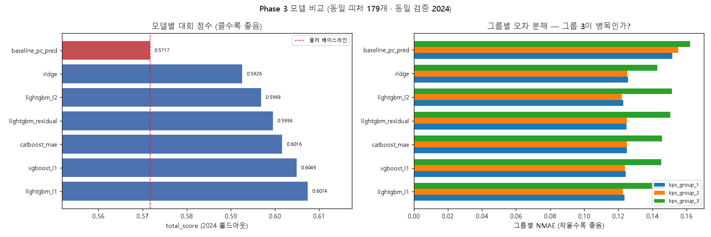
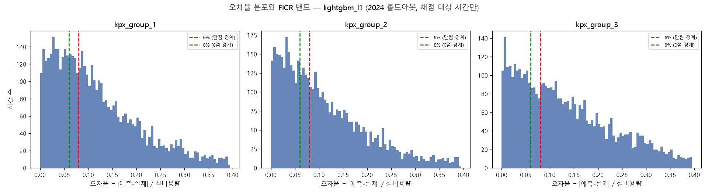
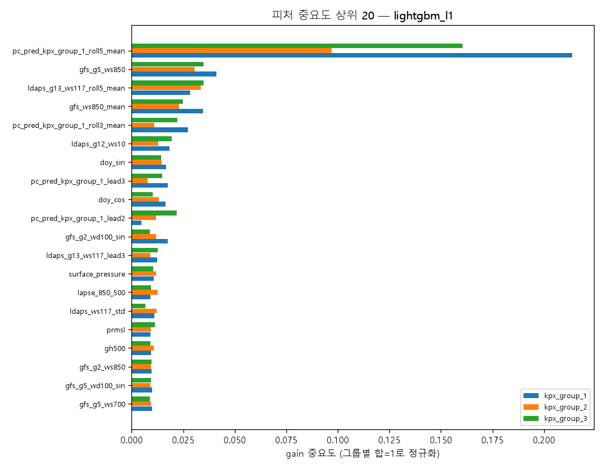

# Phase 3. 모델 선택 — `04_model_selection.ipynb`

같은 피처(179개), 같은 검증(2024 홀드아웃), 같은 시드로 6개 후보를 비교해
**LightGBM (L1 손실)** 을 선택한 기록이다. 2024 홀드아웃 `total_score` **0.6074** (물리 베이스라인 대비 **+0.0357**).

---

## 1. 왜 (Why) — 이유와 근거

### 1-1. 이 Phase가 답해야 할 질문 3개

1. **모델이 물리 예측치(`pc_pred`)를 실제로 이기는가?** 못 이기면 머신러닝을 쓸 이유가 없다.
   Phase 2에서 만든 파워커브 하이브리드 피처는 모델 없이도 이미 예측값이다.
2. **어떤 모델 계열이 이 데이터에 맞는가?** "요즘 LightGBM 많이 쓰니까"로 고르지 않는다.
   **데이터의 형태를 먼저 재고**, 그 형태에 맞는 모델을 문헌 근거와 함께 고른다.
3. **손실함수를 무엇으로 둘 것인가?** 대회 산식은 절대오차(MAE) 기반인데,
   대부분의 회귀 모델은 기본값이 제곱오차(MSE)다. 그대로 쓰면 산식과 어긋난다.

### 1-2. 공정 비교의 조건 (CLAUDE.md 11번 Phase 3)

비교 조건을 하나라도 다르게 하면 어느 쪽이 좋은지 알 수 없게 된다. 모든 후보에 아래를 똑같이 적용했다.

| 고정 조건 | 값 |
|---|---|
| 피처 | Phase 2의 179개 전부 |
| 학습 기간 | 2022-01-01 ~ 2023-12-31 |
| 검증 기간 | **2024년 전체 (홀드아웃)** — 학습·조기종료·튜닝 어디에도 쓰지 않음 |
| 평가 산식 | `src/metric.py`의 대회 공식 산식 (import, 복사 금지) |
| 랜덤 시드 | 42, 스레드 4개 고정 |
| 학습률 | 0.05 (세 GBDT 공통), 깊이/잎 수도 대응되게 맞춤 |
| 후처리 | `clip(0, 설비용량)` |

---

## 2. 어떻게 (How) — 과정

노트북은 마크다운 16개 + 코드 17개, 총 33개 셀이다.

### 2-1. 데이터 형태 측정 — 모델을 고르기 **전에** 반드시 할 일 (셀 4~6)

"어떤 모델이 좋은가"는 데이터의 형태에 따라 달라진다. 논문을 읽기 전에 우리 데이터를 먼저 쟀다.

**(1) 규모**

| 항목 | 값 |
|---|---:|
| 학습 (2022~2023) | 17,520행 |
| 검증 (2024) | 8,784행 |
| 피처 | 179개 |

**(2) 그룹별 학습 가능 행 수** — 라벨이 있는 행만 학습할 수 있다 (`kpx_group_3`의 2022년은 결측)

| 그룹 | 학습(22~23) | 검증(2024) | 검증 채점대상 | 채점 비율 | **행/피처** |
|---|---:|---:|---:|---:|---:|
| kpx_group_1 | 17,422 | 8,778 | 4,990 | 56.8% | 97.3 |
| kpx_group_2 | 17,423 | 8,778 | 4,977 | 56.7% | 97.3 |
| **kpx_group_3** | **8,760** | 8,778 | 4,567 | 52.0% | **48.9** |

→ **그룹 3은 학습 데이터가 절반뿐이고 피처당 49행에 불과하다.** 과적합 위험이 구조적으로 높다.

**(3) 타깃 분포** — 정규분포인가?

| 그룹 | 평균 이용률 | 중앙값 | 왜도 | 거의 0 (<2%) | 거의 정격 (>95%) |
|---|---:|---:|---:|---:|---:|
| kpx_group_1 | 0.307 | 0.197 | +0.668 | 23.1% | 1.9% |
| kpx_group_2 | 0.328 | 0.203 | +0.581 | 23.3% | 1.5% |
| kpx_group_3 | 0.265 | 0.129 | +0.940 | 30.2% | 2.3% |

→ 평균 > 중앙값, 왜도 양수 = **오른쪽으로 긴 꼬리. 정규분포가 아니다.**
→ 0 근처에 23~30%가 몰려 있고, 위로는 설비용량이라는 **물리적 상한**이 있다 (유계 분포).

**(4) 그룹 1과 2를 하나의 모델로 묶어도 되는가** — 같은 기종·같은 단지라 발전 패턴이 매우 유사할 것으로 예상했다.

- 라벨 상관: `group_1` ↔ `group_2` = **0.9553** (매우 높음)
- 그런데 `|group_1 − group_2| / 설비용량`: 중앙값 **3.1%**, 평균 6.2%, 90분위 **17.0%**

**여기서 판단이 갈린다.** FICR 만점 밴드는 오차율 **6% 이내**다.
두 그룹의 실제 차이가 중앙값 3.1%, 90분위 17%나 되므로, **같은 값을 예측하는 순간 그 차이만큼 밴드를 잡아먹는다.**
상관이 0.955로 높아도 **그룹별로 모델을 따로 학습해야 한다**는 결론.
(상관계수는 "같이 오르내리는가"만 말할 뿐, "값이 같은가"는 말해 주지 않는다.)

**(5) 다중공선성**

- 피처쌍 `|상관|` 평균 0.370
- `|상관| > 0.90`인 쌍: **1,188 / 15,931 (7.5%)**
- `|상관| > 0.99`인 쌍: **96개**

거의 똑같은 피처 쌍이 많다(같은 풍속의 격자별 값, lag/lead 등). 당연한 결과다.
→ **선형회귀는 다중공선성에서 계수가 폭주**하므로 정규화(Ridge)가 필수다.
→ **결정트리는 둘 중 하나를 골라 자르면 그만**이라 영향이 거의 없다.

**(6) 분포 이동** — test(2025)가 train과 다른가

| 피처 | 학습 22~23 | 검증 2024 | test 2025 | 2025 − train |
|---|---:|---:|---:|---:|
| `ldaps_ws117_mean` | 8.9803 | 8.8368 | 9.5663 | **+0.5860** |
| `gfs_ws117_mean` | 3.9650 | 3.9046 | 4.2412 | +0.2762 |
| `t_hub_c` | 6.7198 | 7.4140 | 6.9250 | +0.2052 |
| `icing_score` | 0.0479 | 0.0903 | 0.0672 | +0.0193 |

**test(2025)의 예보 풍속이 학습 기간보다 뚜렷하게 높다.** 2025년은 예보상 더 바람이 센 해다.
"트리 모델은 학습 범위 밖을 예측하지 못한다"는 잘 알려진 약점이 여기서 문제가 되는지 반드시 확인해야 한다.

### 2-2. "트리는 외삽을 못 한다" — 우리 데이터에서 실제로 문제가 되는가 (셀 8)

결정트리는 학습 데이터를 구간으로 잘라 각 구간의 대표값을 답으로 내므로,
**학습에서 본 적 없는 범위의 입력이 오면 가장 가까운 구간의 값을 되풀이**한다.
학습 타깃의 최댓값보다 큰 값은 절대 예측하지 못한다 [5].

그래서 직접 쟀다. **"평균이 이동한 것"과 "범위를 벗어난 것"은 전혀 다른 문제**이기 때문이다.

| 피처 | train 범위 | test 범위 | **범위 이탈 행 비율** |
|---|---|---|---:|
| `ldaps_ws117_mean` | [0.333, 34.032] | [0.432, 28.095] | **0.000%** |
| `ldaps_g13_ws117` | [0.023, 36.069] | [0.196, 30.503] | **0.000%** |
| `gfs_ws117_mean` | [0.313, 21.716] | [0.646, 20.285] | **0.000%** |
| `pc_pred_kpx_group_1` | [0, 19999.3] | [0, 19999.3] | **0.000%** |
| `t_hub_c` | [-24.035, 28.381] | [-20.490, 27.681] | 0.000% |

179개 피처 전체 평균 범위 이탈률: **0.0084%** (가장 큰 `t850_c`도 0.388%)

**결론: 트리의 외삽 약점은 이 문제에서 발동하지 않는다.** 세 가지 이유다.

1. **범위 이탈이 사실상 0이다.** +0.59 m/s는 "본 적 없는 강풍이 분다"가 아니라
   **"이미 본 범위 안에서 평균이 조금 옮겨갔다"** 는 뜻이다. test 최댓값(28.1)이 train 최댓값(34.0)보다 오히려 작다.
2. **타깃에 물리적 상한이 있다.** 발전량은 설비용량을 넘을 수 없고, 학습 데이터에 정격 출력 시간이 이미 충분히 들어 있다.
3. **파워커브는 고풍속에서 평평하다.** 강풍이 더 세져도 출력은 정격에서 더 오르지 않는다.
   즉 트리가 "마지막 구간 값을 되풀이"하는 동작이 **오히려 물리적으로 옳다.** 약점이 아니라 올바른 귀납 편향이다.

> 타깃이 주가처럼 상한 없이 자라는 값이었다면 이 판단은 정반대가 되었을 것이다.
> **"트리는 외삽을 못 한다"는 명제는 참이지만, 그것이 문제가 되는지는 데이터마다 다르다.** 그래서 직접 쟀다.

### 2-3. 모델 후보 선정 — 문헌 근거 (셀 9~10 마크다운)

측정한 데이터 형태를 요약하면: **표 형태 · 중소 규모 · 유계 왜도 타깃 · 강한 다중공선성 · 외삽 불필요.**

**왜 GBDT(그래디언트 부스팅 트리)인가**

- 표 형태 중소규모 데이터에서 **GBDT가 딥러닝을 앞선다는 것이 벤치마크의 반복된 결론**이다.
  GBDT는 **표본 3,000 ~ 1,000,000개 구간**에서 최고 성능을 낸다고 보고된다 [1][2].
  우리 데이터(17,520행)는 정확히 그 구간 안에 있다.
- 원인으로 지목되는 것은 **귀납 편향(inductive bias)** 이다. 트리는 축에 나란한 경계로 자르므로
  "풍속 3m/s 아래는 발전 0" 같은 **불연속·계단형 관계**를 곧바로 표현한다.
  신경망은 회전 불변(rotationally invariant)이라 이런 구조를 처음부터 다시 배워야 한다 [1].
  **파워커브(cut-in, 정격 포화)가 바로 그 계단형 관계다.** 우리 문제의 본질과 트리의 귀납 편향이 정확히 일치한다.
- **풍력 예측 대회의 우승 해법이 실제로 GBDT다.** GEFCom 2012는 시간·기상 파생 피처 + GBDT로 우승했고 [3],
  2024년 HREFTC 우승팀은 NWP 소스별 CatBoost + 격자점의 raw/lagged/differenced 피처를 썼다 [4].

**딥러닝을 배제하지 않고 "검증"하는 방법**

CLAUDE.md 11번은 "딥러닝은 데이터가 적어 과적합 위험을 **명시적으로 검증**하라"고 요구한다.
그런데 신경망을 제대로 학습·튜닝하려면 그 자체로 Phase 하나가 필요하다.
그래서 **선형 모델(Ridge)을 "GBDT가 아닌 쪽"의 대표로 세웠다.**

- Ridge는 신경망과 같은 **매끄러운(smooth) 함수 계열**이고, 계단형 관계를 표현하지 못한다는 약점을 공유한다.
- 학습이 결정론적이고 순식간에 끝나며 하이퍼파라미터가 하나(`alpha`)뿐이라 **공정 비교가 쉽다.**
- Ridge가 GBDT에 크게 뒤진다면 "이 데이터는 계단형·비선형 구조가 지배적"이라는 증거가 된다.
  반대로 대등하다면 관계가 거의 선형이라는 뜻이므로 그때 신경망을 진지하게 검토한다.

**비교할 후보 6가지 + 베이스라인 2개**

| # | 이름 | 무엇을 확인하려는가 |
|---|---|---|
| 0a | `baseline_pc_pred` | **모델 없이도 얼마나 맞히는가.** 이걸 못 넘으면 ML을 쓸 이유가 없다 |
| 0b | `baseline_pc_pred_rho` | 밀도 보정이 실제로 도움이 되는가 |
| 1 | **Ridge** | 비(非)트리 계열 대표. 관계가 선형인가? |
| 2 | **LightGBM (L1)** | GBDT 표준. 대회 산식에 맞춘 손실 |
| 3 | **LightGBM (L2)** | **손실함수만 바꾼 대조군** |
| 4 | **XGBoost (L1)** | 다른 GBDT 구현. LightGBM이 우연히 잘 나온 건 아닌지 |
| 5 | **CatBoost (MAE)** | HREFTC 2024 우승 해법이 쓴 구현 [4] |
| 6 | **LightGBM 잔차 학습** | 타깃을 `실제 − pc_pred`로 두는 물리+통계 하이브리드 |

### 2-4. 손실함수를 산식에서 역산하기 (셀 11 마크다운)

**점수에 직접 영향을 주는데 놓치기 쉬운 곳**이라 별도로 설계했다.

대회 산식은 `total_score = 0.5·(1 − NMAE) + 0.5·FICR`.

- **NMAE**는 `|예측 − 실제|`의 평균 = **절대오차(L1)**
- **FICR**는 오차율 6% 이내 만점, 6~8% 3/4점, 초과 0점인 **계단 함수**

| 손실 | 최적 예측값 | 큰 오차에 대한 태도 |
|---|---|---|
| L2 (제곱오차, 대부분의 기본값) | 조건부 **평균** | 큰 오차 하나를 줄이려고 전체를 희생 |
| **L1 (절대오차)** | 조건부 **중앙값** | 큰 오차를 포기하고 다수를 정확히 맞힘 |

**왜 L1인가**: 어느 시각의 발전량이 "보통 10,000kWh인데 가끔 2,000kWh(터빈 정지)"라고 하자.
L2는 평균인 8,000 근처를 예측해 **평소에도 2,000kWh씩 틀린다**(오차율 9.3% → FICR 0점).
L1은 중앙값인 10,000을 예측해 **대부분의 시간을 6% 밴드 안에 넣고**, 가끔 오는 정지 시간만 크게 틀린다.

FICR이 계단 함수라는 점이 이 선택을 더 강하게 만든다.
**8%를 넘긴 오차는 9%든 50%든 똑같이 0점**이므로 큰 오차를 줄이려 애쓸 이유가 없다.

→ 이 논리를 말로만 두지 않고, 후보 2(L1)와 3(L2)을 **다른 조건은 전부 똑같이 두고** 비교해 숫자로 검증했다 (§3-2).

### 2-5. 검증 설계 — 2024년을 어떻게 지킬 것인가 (셀 12~13)

GBDT는 트리를 몇 그루 쌓을지 정해야 한다. 보통 **조기 종료(early stopping)** 로 정한다.

**함정**: 조기 종료에 2024년을 쓰면, 2024년을 "몇 그루에서 멈출지" 고르는 데 쓴 것이다.
그러면 2024년 점수는 더 이상 정직한 홀드아웃 점수가 아니다 (CLAUDE.md 4번).

**해결**: 학습 기간 안에서 다시 시간 분할을 만들었다.

```
|<---------- 학습 2022-01 ~ 2023-12 ---------->|<--- 홀드아웃 2024 --->|
|<- 내부학습 2022-01~2023-06 ->|<- 내부검증 23-07~12 ->|   (건드리지 않음)
        (조기 종료 기준을 여기서 정함)
```

1. 내부학습으로 학습 → **내부검증**에서 조기 종료 → 최적 트리 수 `best_iter`
2. 그 수를 **학습 데이터가 늘어난 비율만큼 키워서**(`× 전체행수/내부학습행수`) 2022~2023 **전체**로 재학습
   (데이터가 많아지면 같은 성능에 더 많은 트리가 필요하다)
3. 완성된 모델로 **2024년을 딱 한 번** 예측

| 그룹 | 최종학습 | 내부학습 | 내부검증 (그중 채점대상) | 홀드아웃 |
|---|---:|---:|---:|---:|
| kpx_group_1 | 17,422 | 13,009 | 4,413 (2,652) | 8,784 |
| kpx_group_2 | 17,423 | 13,009 | 4,414 (2,663) | 8,784 |
| kpx_group_3 | 8,760 | 4,344 | 4,416 (2,311) | 8,784 |

**조기 종료의 기준도 산식에 맞췄다.** 내부검증 중 **채점 대상(이용률 ≥ 10%)인 시간만** 골라 그 MAE로 판단한다.
NMAE는 MAE를 설비용량(상수)으로 나눈 값이므로, 채점 대상 시간의 MAE 최소화 = NMAE 최소화다.
(채점되지 않는 저풍속 시간의 오차를 줄이려고 트리를 더 쌓는 낭비를 막는다.)

Ridge의 `alpha`도 같은 방식으로 내부검증에서 골랐다. 표준화(`StandardScaler`)는 **학습 데이터에서만 fit** 했다 (CLAUDE.md 4번).

---

## 3. 결과 (Result)

### 3-1. 전체 비교표 (2024 홀드아웃, `total_score` 내림차순)

| 모델 | **total_score** | 1−NMAE | FICR | NMAE g1 | NMAE g2 | NMAE g3 | FICR g1 | FICR g2 | FICR g3 | 학습(초) |
|---|---:|---:|---:|---:|---:|---:|---:|---:|---:|---:|
| **lightgbm_l1** | **0.6074** | 0.8690 | **0.3459** | 0.1236 | 0.1226 | 0.1469 | 0.3450 | 0.4271 | 0.2656 | 21.9 |
| xgboost_l1 | 0.6049 | 0.8689 | 0.3409 | 0.1243 | 0.1239 | 0.1451 | 0.3404 | 0.4132 | 0.2691 | 15.0 |
| catboost_mae | 0.6016 | 0.8680 | 0.3353 | 0.1251 | 0.1251 | 0.1457 | 0.3320 | 0.4066 | 0.2671 | 85.0 |
| lightgbm_residual | 0.5996 | 0.8666 | 0.3325 | 0.1247 | 0.1249 | 0.1505 | 0.3385 | 0.4114 | 0.2476 | 32.7 |
| lightgbm_l2 | 0.5969 | 0.8679 | 0.3259 | 0.1229 | 0.1220 | 0.1514 | 0.3432 | 0.3785 | 0.2560 | 6.7 |
| ridge | 0.5926 | 0.8688 | 0.3164 | 0.1256 | 0.1252 | 0.1429 | 0.3093 | 0.3740 | 0.2660 | 0.3 |
| `baseline_pc_pred` | 0.5717 | 0.8437 | 0.2998 | 0.1518 | 0.1552 | 0.1621 | 0.2928 | 0.3558 | 0.2508 | 0.0 |
| `baseline_pc_pred_rho` | 0.5601 | 0.8389 | 0.2813 | 0.1581 | 0.1584 | 0.1667 | 0.2716 | 0.3366 | 0.2356 | 0.0 |

**선택: `lightgbm_l1`** — total_score 0.6074, 물리 베이스라인 대비 **+0.0357**.



**이 그림에서 읽어야 할 것**: (왼쪽) 모든 ML 모델이 물리 베이스라인(빨간 점선)을 넘는다 —
머신러닝이 실제로 기여한다. (오른쪽) 모든 모델에서 **그룹 3(초록)의 NMAE가 가장 크다.**
그룹 3이 평균을 깎는 병목이라는 것이 모델을 바꿔도 변하지 않는다.

### 3-2. 가장 중요한 발견 — 모델 간 차이는 NMAE가 아니라 **FICR에서 난다**

비교표를 세로로 읽으면 이상한 것이 보인다.

| 모델 | 1−NMAE | FICR |
|---|---:|---:|
| lightgbm_l1 | 0.8690 | **0.3459** |
| ridge | 0.8688 | **0.3164** |
| lightgbm_l2 | 0.8679 | 0.3259 |

**1−NMAE는 6개 모델이 0.8666 ~ 0.8690으로 사실상 같다** (폭 0.0024).
심지어 **Ridge(0.8688)가 LightGBM(0.8690)과 소수점 셋째 자리까지 같다.**
그런데 **FICR은 0.3164 ~ 0.3459로 뚜렷하게 갈린다** (폭 0.0295, NMAE 폭의 **12배**).

즉 **모델들은 "평균적으로 얼마나 틀리는가"에서는 거의 차이가 없고, "오차가 6% 밴드 안에 들어가는가"에서 갈린다.**
평균 오차가 같아도 오차의 **분포 모양**이 다르면 FICR이 달라진다.

이것이 **손실함수 실험이 확인해 준 바로 그 메커니즘**이다.

### 3-3. 손실함수 L1 vs L2 — 예측이 맞았다

다른 조건은 완전히 동일하게 두고 손실함수만 바꾼 결과:

| 지표 | L1 | L2 | **L1 − L2** |
|---|---:|---:|---:|
| total_score | 0.6074 | 0.5969 | **+0.0105** |
| 1−NMAE | 0.8690 | 0.8679 | +0.0011 |
| **FICR** | **0.3459** | 0.3259 | **+0.0200** |

**개선의 95%가 FICR에서 왔다** (+0.0200 중 total 기여 +0.0100, NMAE 기여는 +0.0005).

§2-4에서 "L1은 중앙값을 맞혀 다수의 시간을 6% 밴드 안에 넣고, L2는 평균을 맞혀 평소에도 조금씩 틀린다"고
예측했는데, 정확히 그대로 나왔다. **평균 오차는 거의 같은데 밴드 안에 든 시간이 늘었다.**

> 이 실험 하나가 total_score를 +0.0105 올렸다. 모델 계열을 바꾼 것(LightGBM ↔ XGBoost, +0.0025)보다 **4배 큰 효과**다.
> **산식을 읽고 손실함수를 맞추는 것이 모델을 고르는 것보다 중요했다.**

### 3-4. Ridge의 성적이 말해 주는 것

Ridge는 total_score 0.5926으로 **모든 GBDT보다 낮지만 물리 베이스라인(0.5717)보다는 확실히 높다.**
그리고 **NMAE는 LightGBM과 동률**(0.8688 vs 0.8690)이다.

해석: **평균 수준의 관계는 선형에 가깝다.** 풍속이 오르면 발전량이 오른다는 큰 그림은 선형 모델도 잡는다.
GBDT가 이기는 지점은 **계단형·비선형 구조**(cut-in 근처, 정격 포화, 결빙 조건 조합)이고,
그것이 정확히 **FICR(6% 밴드)** 에서 드러난다.

→ **딥러닝 검토에 대한 답**: 매끄러운 함수 계열(Ridge)이 NMAE는 따라잡지만 FICR에서 0.03 뒤진다.
신경망도 같은 계열이므로, 이 계단형 구조를 배우려면 훨씬 많은 데이터가 필요하다.
학습 데이터 17,520행(그룹 3은 8,760행)에서 딥러닝이 GBDT를 이길 근거가 없다.
**Phase 4 이후에도 GBDT로 간다.**

### 3-5. 예상이 빗나간 것 — 잔차 학습이 더 나빴다

CLAUDE.md 13번은 "NWP 풍속 → 파워커브 → 물리 예측치를 만들고 **ML이 잔차를 학습**하는 하이브리드가
순수 ML보다 안정적"이라는 문헌 결론을 제시한다. 그래서 후보 6번(타깃 = `실제 − pc_pred`)을 넣었다.

**결과는 반대였다**: `lightgbm_residual` 0.5996 < `lightgbm_l1` 0.6074 (−0.0078).
특히 **그룹 3의 NMAE가 0.1469 → 0.1505로 나빠졌다.**

**원인 가설**: 우리는 이미 `pc_pred_*`를 **피처로** 넣어 두었다.
GBDT는 그 피처를 자유롭게 쓸 수 있으므로, 필요하면 스스로 "잔차 학습"에 해당하는 함수를 만들 수 있다.
반면 타깃을 잔차로 **고정**하면 "예측 = pc_pred + f(x)"라는 **덧셈 구조를 강제**하게 된다.
파워커브가 틀리는 구간(결빙, 정지)에서는 곱셈적(비율) 보정이 맞을 수 있는데 그 자유를 빼앗은 것이다.

문헌의 "하이브리드가 낫다"는 결론은 **물리 예측치를 피처로 쓸 수 없는 상황**(예: 선형모델, 얕은 모델)을
전제한 경우가 많다. **우리 설정에서는 `pc_pred`를 피처로 주는 것만으로 하이브리드의 이득을 이미 얻고 있다.**

### 3-6. FICR 밴드 분석 — 점수가 어디서 새는가



최고 모델(`lightgbm_l1`)의 2024년 채점 대상 시간에 대한 오차율 분포:

| 그룹 | ≤6% (만점) | 6~8% (3/4점) | **>8% (0점)** | 8~10% (아까운 구간) |
|---|---:|---:|---:|---:|
| kpx_group_1 | 31.3% | 10.0% | **58.7%** | 9.5% |
| kpx_group_2 | 34.5% | 9.9% | **55.5%** | 8.9% |
| kpx_group_3 | 28.1% | 7.2% | **64.7%** | 7.8% |

**이 그림에서 읽어야 할 것**: 히스토그램이 **8% 경계 바로 오른쪽에 봉우리를 만들지 않는다.**
0에서부터 완만하게 감소하는 모양이다.

**중요한 함의**: CLAUDE.md 5번은 "경계(6~8%)에 걸친 시간대를 밴드 안으로 밀어 넣는 후처리가 점수에 직접적"이라고
기대했지만, **실제 분포는 경계에 몰려 있지 않다.** 8~10% 구간은 전체의 7.8~9.5%뿐이다.
즉 **후처리로 짜낼 수 있는 여지는 제한적이고, 절반 이상(55~65%)이 8%를 넘겨 0점을 받고 있다.**
점수를 올리려면 **모델 자체의 정확도**를 올려야 한다. (그래도 8~10% 구간의 8~9%는 실질적 기회다.)

### 3-7. 피처 중요도 — 물리 하이브리드가 작동하는가



`lightgbm_l1`의 gain 중요도 상위 10개 (그룹별 합=1로 정규화):

| 피처 | g1 | g2 | g3 | 평균 |
|---|---:|---:|---:|---:|
| `pc_pred_kpx_group_1_roll5_mean` | 0.2136 | 0.0970 | 0.1605 | **0.1570** |
| `gfs_g5_ws850` | 0.0411 | 0.0306 | 0.0350 | 0.0356 |
| `ldaps_g13_ws117_roll5_mean` | 0.0285 | 0.0336 | 0.0349 | 0.0323 |
| `gfs_ws850_mean` | 0.0346 | 0.0231 | 0.0250 | 0.0276 |
| `pc_pred_kpx_group_1_roll3_mean` | 0.0274 | 0.0111 | 0.0221 | 0.0202 |
| `ldaps_g12_ws10` | 0.0184 | 0.0129 | 0.0195 | 0.0169 |
| `doy_sin` | 0.0167 | 0.0145 | 0.0143 | 0.0152 |
| `pc_pred_kpx_group_1_lead3` | 0.0176 | 0.0077 | 0.0149 | 0.0134 |
| `doy_cos` | 0.0165 | 0.0131 | 0.0102 | 0.0133 |
| `gfs_g2_wd100_sin` | 0.0175 | 0.0119 | 0.0090 | 0.0128 |

**물리 예측치(`pc_pred*`) 계열이 전체 중요도의 23.6%** 를 차지한다. Phase 2의 하이브리드 설계가 작동한다.

세 가지를 더 읽을 수 있다.

1. **1위가 원본 `pc_pred`가 아니라 5시간 이동평균(`roll5_mean`)** 이다 (15.7% vs 원본은 상위 10위 밖).
   시간당 예보에는 잡음이 있고, 앞뒤 시각을 평균하면 그 잡음이 줄어든다.
   Phase 2에서 상관 분석으로 본 것과 같은 신호다. **예측값 자체의 시간축 평활을 Phase 4/5에서 검토할 근거.**
2. **2위가 `gfs_g5_ws850`(850hPa 상층 바람)** 이다. 예상 밖의 순위다.
   850hPa는 해발 약 1,500m로 허브(약 1,120m)보다 400m 위다.
   지형에 덜 휘둘리는 **큰 규모의 흐름**이 지표 예보의 오차를 보완해 주는 것으로 보인다.
   → `reports/phase2_features.md` §4-5 우선순위 3("GFS는 850hPa를 허브 조건으로 쓰라")을 강하게 뒷받침한다.
3. **그룹 1의 `pc_pred`에 세 그룹 모두가 의존한다.** 그룹 3 모델조차 `pc_pred_kpx_group_1_*`를 가장 많이 쓴다.
   그룹 1은 SCADA가 3년치라 파워커브가 가장 안정적으로 추정됐기 때문으로 보인다.
   **라벨이 적은 그룹 3에 그룹 1의 정보를 흘려보내는 설계가 실제로 작동하고 있다.**

### 3-8. 재현성 검증 (CLAUDE.md 12번)

최고 모델을 처음부터 다시 학습해 예측값을 비교했다.

| 그룹 | 두 번 실행 결과 완전 동일 | 최대 차이 |
|---|---|---:|
| kpx_group_1 | True | 0.000e+00 |
| kpx_group_2 | True | 0.000e+00 |
| kpx_group_3 | True | 0.000e+00 |

**비트 단위로 동일하다.** `deterministic=True`, `force_row_wise=True`, 시드·스레드 수 고정이 효과가 있었다.
2차 평가의 "Private Score 복원 가능" 요건을 지금 시점에서 충족한다.

### 3-9. 실험 로그

`experiments/log.csv`에 8개 실험을 CLAUDE.md 5번 규칙의 컬럼 구조로 기록했다
(`exp_id, date, git_hash, model, features, total_score, 1-NMAE, FICR, 그룹별 NMAE×3, 그룹별 FICR×3, val_period, fit_seconds, public_score, note`).
`public_score`는 리더보드 제출 후 채운다.

---

## 4. 해석과 다음 단계 (So what)

### 4-1. 이 Phase의 3가지 질문에 대한 답

1. **모델이 물리 예측치를 이기는가?** → **그렇다.** 0.5717 → 0.6074 (+0.0357).
   특히 1−NMAE가 0.8437 → 0.8690으로 크게 올랐다. ML이 파워커브가 못 잡는 구조를 배우고 있다.
2. **어떤 모델 계열인가?** → **GBDT, 그중 LightGBM.** 문헌 근거(중소규모 tabular)와
   우리 데이터의 계단형 구조(파워커브)가 일치하고, 외삽 약점은 직접 측정해 발동하지 않음을 확인했다.
   Ridge와의 격차가 FICR에만 나타난다는 사실이 "계단형 구조가 핵심"이라는 진단을 뒷받침한다.
3. **손실함수는?** → **L1(절대오차).** total_score +0.0105, 그중 FICR 기여가 95%.

### 4-2. 예상과 달랐던 점

- **잔차 학습이 더 나빴다** (§3-5). `pc_pred`를 피처로 주는 것만으로 하이브리드의 이득이 이미 확보된다.
  덧셈 구조를 강제하면 오히려 모델의 자유를 빼앗는다.
- **밀도 보정판(`pc_pred_rho`)이 원본보다 나빴다** (0.5601 < 0.5717). Phase 2의 관찰과 일치한다.
- **오차가 FICR 경계에 몰려 있지 않다** (§3-6). 후처리로 짜낼 여지가 기대보다 적다.
- **모델 간 차이가 NMAE가 아니라 FICR에서 난다.** 앞으로 실험을 평가할 때
  "NMAE를 먼저 본다"(CLAUDE.md 5번)는 원칙은 유지하되, **NMAE가 안 움직여도 FICR이 움직일 수 있음**을 기억해야 한다.

### 4-3. 다음 단계 (Phase 4: `05_tuning.ipynb`)

1. **LightGBM 하이퍼파라미터 튜닝** (Optuna). 목적함수는 단순 MAE가 아니라
   **내부검증의 대회 total_score**로 둔다. 2024는 계속 건드리지 않는다.
2. **그룹 3 전용 전략**. 모든 모델에서 그룹 3의 NMAE가 가장 크고 FICR이 가장 낮다.
   학습 행이 절반뿐(8,760행, 피처당 49행)이라는 구조적 원인이 있다. 시도할 것:
   - 그룹 1·2 데이터로 사전학습 후 그룹 3 파인튜닝 (전이학습)
   - 그룹 3 모델에 그룹 1·2의 라벨을 보조 타깃으로 주는 multi-task
   - 그룹 3에만 더 강한 정규화 / 얕은 트리
3. **Phase 2에서 미뤄 둔 피처 추가**를 이제 측정한다 (`reports/phase2_features.md` §4-5).
   기준선이 확보됐으므로 하나씩 넣고 total_score 변화를 실험 로그에 기록한다.
   **§3-7에서 `gfs_ws850`이 2위로 나온 만큼, "GFS 850hPa 활용"(우선순위 3)의 기대값이 특히 높다.**
4. **예측값 시간축 평활 검토**. 중요도 1위가 `roll5_mean`이라는 사실은
   "입력을 평활하면 좋아진다"는 뜻이고, 출력 평활도 시도해 볼 근거가 된다.
5. **앙상블**. LightGBM/XGBoost/CatBoost가 0.6074/0.6049/0.6016으로 근소하게 다르다.
   서로 다른 오차를 낸다면 평균이 개선될 수 있다. 시드 앙상블도 함께 검토.
6. **단조 변환 피처 정리**. 최종 모델이 트리 계열로 확정됐으므로,
   `ws117_sq`/`ws117_cube` 계열(트리에겐 정보량 0)을 빼고 성능이 같은지 확인한다
   (`reports/phase2_features.md` §2-10).

### 4-4. 산출물

| 파일 | 내용 | git 추적 |
|---|---|---|
| `04_model_selection.ipynb` | 이 Phase의 전체 과정 (33셀) | ○ |
| `experiments/log.csv` | 실험 8건 (exp001~exp008) | ○ |
| `reports/figures/phase3_model_comparison.png` | 모델별 점수 / 그룹별 NMAE | ○ |
| `reports/figures/phase3_ficr_band.png` | 오차율 분포와 6%/8% 밴드 | ○ |
| `reports/figures/phase3_feature_importance.png` | gain 중요도 상위 20 | ○ |
| `requirements.txt` | lightgbm 4.6.0, xgboost 3.3.0, catboost 1.2.10, scikit-learn 1.9.0 추가 | ○ |

---

## 참고문헌

1. Grinsztajn, Oyallon, Varoquaux, *Why do tree-based models still outperform deep learning on typical tabular data?*, NeurIPS 2022.
   <https://www.researchgate.net/publication/401451156_Why_Do_Tree-Based_Models_Still_Outperform_Deep_Learning_on_Typical_Tabular_Data>
   → 트리의 귀납 편향(축 정렬 분할, 회전 비불변)이 표 데이터에서 유리한 이유. **GBDT 선택의 핵심 근거.**
2. *Is Deep Learning finally better than Decision Trees on Tabular Data?*, arXiv:2402.03970.
   <https://arxiv.org/html/2402.03970v3>
   → 딥러닝이 GBDT와 대등하거나 열세라는 벤치마크 종합. GBDT는 표본 3천~100만 구간에서 강하다.
3. Silva, *A feature engineering approach to wind power forecasting: GEFCom 2012*, International Journal of Forecasting, 2014.
   <https://www.researchgate.net/publication/259119632_A_feature_engineering_approach_to_wind_power_forecasting_GEFCom_2012>
   → 시간·기상 파생 피처 + GBDT로 풍력 예측 대회 우승.
4. *The Hybrid Renewable Energy Forecasting and Trading Competition 2024*, arXiv:2507.01579.
   <https://arxiv.org/html/2507.01579v1>
   → 우승 해법: NWP 소스별 CatBoost + 격자점 raw/lagged/differenced 피처.
5. Hyper-Trees / 트리의 외삽 한계에 관한 논의, arXiv:2405.07836.
   <https://arxiv.org/pdf/2405.07836>
   → "트리는 학습 타깃 범위 밖을 예측하지 못한다"는 명제. §2-2에서 우리 데이터에 해당하지 않음을 측정으로 확인.
