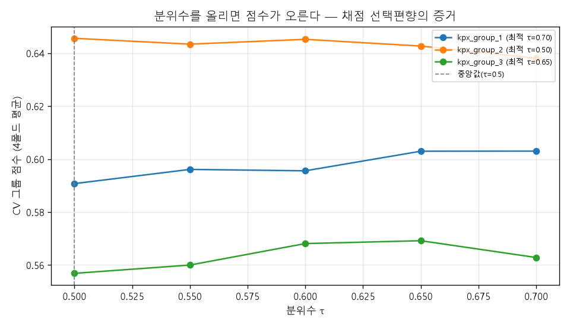
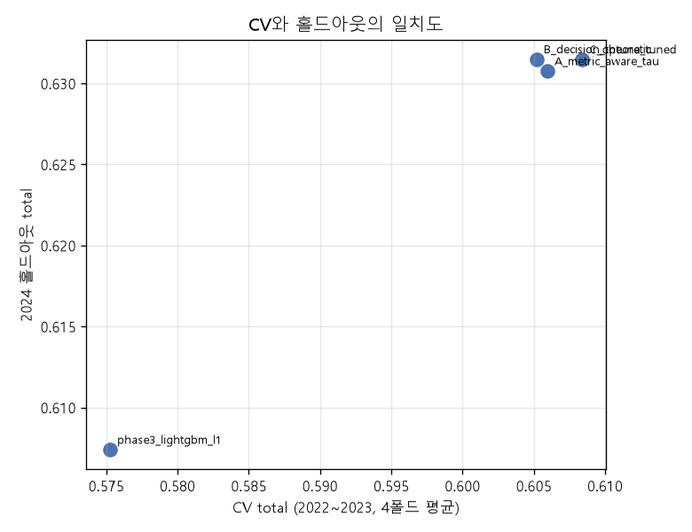
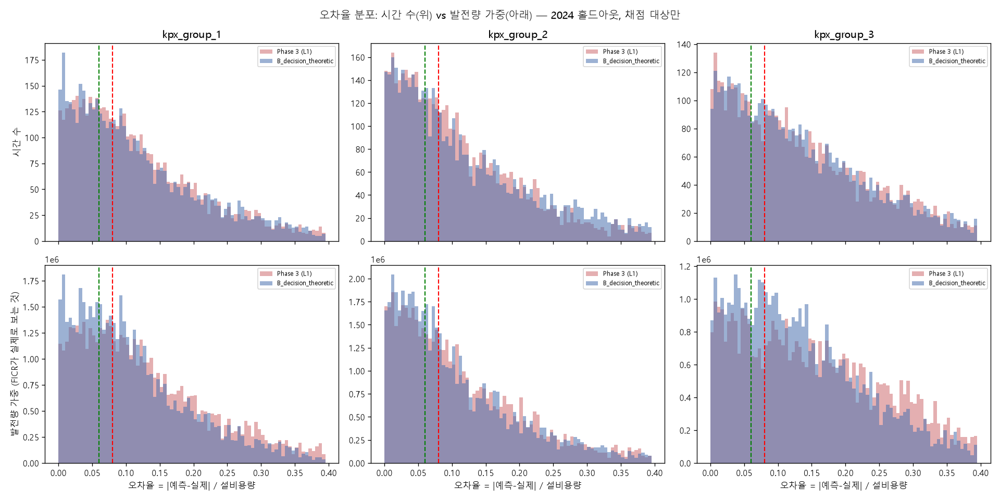

# Phase 4. 튜닝 — 산식을 제대로 최적화하기 (`05_tuning.ipynb`)

Phase 3의 2024 홀드아웃 `total_score` **0.6074**에서 **0.6315**로 올렸다 (**+0.0241**).
개선의 대부분은 모델을 바꿔서가 아니라 **대회 산식을 다시 읽어서** 왔다.

---

## 1. 왜 (Why) — 이유와 근거

### 1-1. Phase 3가 남긴 진단

Phase 3에서 6개 모델을 비교한 결과, **1−NMAE는 0.8666~0.8690으로 사실상 같고 FICR만 0.3164~0.3459로 갈렸다.**
즉 **남은 점수는 거의 전부 FICR에 있다.** 모델 계열을 더 바꿔 봐야 얻을 것이 적다는 뜻이다.

### 1-2. 산식의 선택편향(selection bias) — 이 Phase의 출발점

`src/metric.py`를 다시 읽으면 결정적인 한 줄이 있다.

```python
valid = actual >= capacity * 0.10   # ← actual(정답) 기준이다. 예측값 기준이 아니다.
```

**채점 대상인지 아닌지가 정답값으로 결정된다.** 이것은 타깃에 대한 **선택**이다.
그런데 우리는 모든 시간으로 학습해 `E[y|x]`(그 날씨에서 나올 평균적인 발전량)를 추정하고 있었다.
정작 채점되는 것은 `y`가 큰 시간뿐이므로, 추정해야 할 것은

$$ E[\,y \mid x,\ y \ge 0.1 \times \text{설비용량}\,] $$

이고, 이 값은 항상 `E[y|x]`보다 **크다**. 즉 **모델은 위쪽으로 편향되어야 옳다.**

그리고 예측을 높게 내도 **채점 대상 판정은 `actual`로 하므로 벌점이 없다.**
저풍속 시간을 크게 틀려도 그 시간은 애초에 채점되지 않는다.
**편법이 아니라 추정 대상을 바로잡는 일이다.**

같은 논리가 FICR에도 있다.

```python
ficr = np.sum(actual * unit_price) / np.sum(actual * 4.0)
```

각 시간의 기여가 **`actual`에 비례**한다. 발전량이 큰 시간을 더 정확히 맞히라는 뜻이므로,
학습 시 **`actual`을 표본 가중치로** 주는 것이 산식과 일치한다.

### 1-3. 그런데 검증 설계부터 고쳐야 했다

위 아이디어를 사전조사로 확인해 봤더니, **검증 설계가 먼저 무너져 있었다.**

Phase 3는 조기 종료용으로 **2023년 하반기 6개월** 하나만 내부검증으로 썼다.
그 단일 창으로 분위수 `tau`를 골라 보니:

| | 고른 설정 | 그 설정의 2024 점수 |
|---|---|---|
| 내부검증(6개월) 1위를 따르면 | `채점행 + actual 가중` | 0.6243 |
| 2024에서 실제 1위였던 설정 | `전체학습 tau=0.75` | 0.6349 |

**0.0106을 잃었다.** 6개월 창은 계절이 치우쳐(7~12월) 신뢰할 수 없다.
그래서 이 노트북은 **1번 작업이 다중 시간 폴드 구축**이다. 이것 없이는 어떤 설정이 나은지 판단할 수 없다.

---

## 2. 어떻게 (How) — 과정

노트북은 마크다운 15개 + 코드 20개, 총 35개 셀이다.

### 2-1. `src/metric.py`에 `group_score()` 추가 — 산식은 손대지 않았다

교차검증에서는 그룹마다 학습 가능한 기간이 다르고(`kpx_group_3`는 2023년부터) 폴드도 달라진다.
그래서 **"그룹 하나 + 그 그룹의 예측"만으로 점수를 낼 입구**가 필요했다.

`metric()`은 한 글자도 고치지 않고, 그 안의 그룹 루프 내용을 그대로 옮긴 `group_score()`를 추가했다
(CLAUDE.md 8번: 산식 자체는 수정 금지, 자체 지표 추가는 허용).

**이렇게 해도 되는 이유 — 산식에서 유도한 항등식**:

$$ \text{total} = \tfrac12\left(1-\overline{\text{NMAE}}\right) + \tfrac12\overline{\text{FICR}}
= \frac{1}{3}\sum_{g}\left[\tfrac12\left(1-\text{NMAE}_g\right) + \tfrac12\text{FICR}_g\right] $$

**총점 = 그룹별 점수의 단순 평균**이고, 그룹 간 상호작용이 없다.
따라서 **그룹마다 따로 최적 설정을 골라도 총점을 정확히 최대화**한다.
그룹 3은 데이터가 절반뿐이라 다른 설정이 최적일 수 있으므로 이 자유도가 중요하다.

노트북에서 실제 예측값으로 확인한 결과 두 값의 차이는 **0.00e+00**(비트 단위 동일)이었다.

검증은 코드로도 고정했다. `tests/test_metric.py`에 4개 테스트를 추가했다.

| 테스트 | 확인하는 것 |
|---|---|
| `test_group_score_matches_metric_by_group` | 기존 산식과 nmae/ficr가 완전히 같은가 |
| `test_total_score_decomposes_into_group_mean` | 위 항등식이 성립하는가 |
| `test_group_score_returns_nan_when_no_scored_hours` | 채점 대상이 0개인 폴드에서 안전한가 |
| `test_group_score_ignores_nan_actuals` | 라벨 결측 행(그룹 3의 2022년)이 섞여도 제외되는가 |

### 2-2. 다중 시간 폴드 (rolling-origin, 확장 윈도)

시계열이므로 **항상 과거로 학습하고 미래를 검증**한다 (CLAUDE.md 4번: 랜덤 K-Fold 금지).
사계절을 모두 덮도록 3개월씩 4개의 검증창을 잡았다.

| 그룹 | 폴드 | 학습 라벨 | 검증 행 | 검증 채점대상 | 사용 |
|---|---|---:|---:|---:|---|
| kpx_group_1 | F1 겨울 (23-01~03) | 8,665 | 2,160 | 1,501 | ○ |
| kpx_group_1 | F2 봄 (23-04~06) | 10,825 | 2,184 | 1,355 | ○ |
| kpx_group_1 | F3 여름 (23-07~09) | 13,009 | 2,208 | 988 | ○ |
| kpx_group_1 | F4 가을 (23-10~12) | 15,214 | 2,208 | 1,664 | ○ |
| kpx_group_2 | (동일) | 8,665~15,215 | | 1,340~1,632 | ○ |
| **kpx_group_3** | **F1 겨울** | **0** | – | – | **건너뜀** |
| kpx_group_3 | F2 봄 | 2,160 | 2,184 | 1,175 | ○ |
| kpx_group_3 | F3 여름 | 4,344 | 2,208 | 840 | ○ |
| kpx_group_3 | F4 가을 | 6,552 | 2,208 | 1,471 | ○ |

**그룹 3의 F1은 학습 라벨이 0개**다(2022년 전체 결측). 학습 행이 1,000개 미만인 폴드는 건너뛰고
남은 3개 폴드의 평균으로 평가한다. 항등식(§2-1) 덕분에 그룹마다 폴드 수가 달라도 문제가 없다.

**조기 종료에 관한 정직한 고백**: 교차검증에서는 각 폴드의 **검증셋으로 조기 종료**를 한다.
그 검증셋으로 점수도 매기므로 **CV 점수는 절대값이 조금 낙관적**이다.
다만 (a) 모든 설정에 똑같이 적용되므로 **순위 비교는 공정**하고,
(b) 최종 정직한 숫자는 **한 번도 건드리지 않은 2024 홀드아웃**에서 얻는다.

### 2-3. 실험 A — 산식-인지 학습의 절제(ablation)

스위치를 **하나씩** 켜 가며 무엇이 얼마나 기여하는지 분리했다.
한꺼번에 켜고 "좋아졌다"고 하면 무엇 덕분인지 알 수 없다.

| 설정 | 채점행만 학습 | actual 가중 | **CV total** | g1 | g2 | g3 |
|---|---|---|---:|---:|---:|---:|
| A1 (Phase 3 기준) | ✗ | ✗ | 0.5753 | 0.5650 | 0.6261 | 0.5346 |
| A2 | ○ | ✗ | 0.5894 | 0.5816 | 0.6356 | 0.5511 |
| **A3** | ✗ | **○** | **0.5968** | 0.5911 | 0.6424 | 0.5569 |
| A4 | ○ | ○ | 0.5966 | 0.5957 | 0.6379 | 0.5563 |

**예상이 빗나갔다. `actual` 가중(A3)이 채점행 필터링(A2)보다 좋고, 둘을 합쳐도(A4) 더 좋아지지 않았다.**

이유는 가중치의 정의를 보면 분명하다. 표본 가중치를 `actual`(그 시간의 실제 발전량, kWh)로 주면

- 무풍 시간(발전량 ≈ 0)의 가중치는 **자동으로 0에 가까워진다** → 사실상 학습에서 빠진다
- 채점 경계(설비용량의 10%) 근처 시간은 **작지만 0이 아닌** 가중치를 받는다
- 발전량이 큰 시간은 **큰 가중치**를 받는다 → FICR이 `actual` 가중이라는 사실과 정확히 일치

즉 **`actual` 가중은 채점행 필터링의 "부드러운 버전"이면서, 동시에 FICR의 가중 구조까지 반영한다.**
필터는 10% 경계에서 딱 잘라 정보를 버리지만, 가중은 매끄럽게 줄이며 경계 근처 정보를 살린다.
그래서 둘을 겹쳐도 얻을 것이 없다(A4 ≈ A3).

→ 이후 모든 실험은 **`train_on="all"` + `actual` 가중**을 기본으로 삼는다.

### 2-4. 실험 A 계속 — 분위수 tau 스윕

A3 위에서 분위수 손실(`objective="quantile"`, `alpha=τ`)의 τ를 훑었다.

| τ | 0.50 | 0.55 | 0.60 | **0.65** | 0.70 |
|---|---:|---:|---:|---:|---:|
| CV total | 0.5977 | 0.5998 | 0.6030 | **0.6049** | 0.6013 |

중앙값(τ=0.5)보다 **위쪽으로 밀 때 점수가 오른다.** §1-2의 선택편향 예측과 일치한다.

**그룹별로 최적 τ가 갈렸다.**

| 그룹 | 최적 τ | 그 τ의 CV | τ=0.50일 때 CV |
|---|---:|---:|---:|
| kpx_group_1 | **0.70** | 0.6030 | 0.5907 |
| kpx_group_2 | **0.50** | 0.6456 | 0.6456 |
| kpx_group_3 | **0.65** | 0.5692 | 0.5569 |

**그룹 2는 중앙값이 최적이다.** 위로 밀 필요가 없다는 뜻이다.
그룹 2는 평균 이용률이 0.328로 세 그룹 중 가장 높다(그룹 1은 0.307, 그룹 3은 0.265 — `phase3_model_selection.md` §2-1).
**이용률이 높을수록 10% 임계값 아래에 깔린 확률질량이 적고, 따라서 선택편향도 작다.**
가설과 부합하지만 그룹이 3개뿐이라 단정하지는 않는다.

그룹별 최적 τ 조합의 CV total은 **0.6059**로 단일 τ 최고값(0.6049)보다 높다.
항등식이 보장한 그룹별 개별 튜닝의 자유도가 실제로 값을 했다.

### 2-5. 실험 B — 분포 예측 + 결정이론적 점예측

τ 스윕은 **손으로 더듬는 방법**이다. 격자에서 하나 고를 뿐이고, **시간마다 최적 τ가 다를 수 있다는 점을 무시**한다.
원리적으로 풀어 보자.

**목적함수를 산식에서 유도한다.** 한 시간 `i`의 예측 `ŷᵢ`는 오직 자기 항에만 영향을 준다.
그 항만 떼어 내 2·N·u를 곱하면(다른 시간은 상수이므로 최적해가 안 바뀐다):

$$ g(\hat y) \;=\; -\,\mathbb{E}\big[\,|\hat y - a|\,\big] \;+\; k\cdot \mathbb{E}\big[\,a \cdot \text{price}(|\hat y - a|/u)\,\big],
\qquad k = \frac{u}{4\,\bar a} $$

- `u` = 설비용량, `ā` = 채점 대상 시간의 평균 발전량 (**train에서만 추정** — 규칙 4)
- 첫째 항: 절대오차를 줄여라 (→ 중앙값 성향)
- 둘째 항: **6% 밴드 안에 들어갈 확률을 높여라.** 게다가 `a`로 가중되므로 **발전량이 큰 쪽에 맞추는 것이 유리**

둘째 항 때문에 최적 `ŷ`는 중앙값보다 **위쪽**으로 밀린다. τ가 흉내내던 것을 여기서는 직접 계산한다.

**구현**: τ = 0.05, 0.15, …, 0.95의 **10개 분위수 회귀**를 학습해 각 시간의 조건부 분포를
등확률 10개 점으로 근사한다. 그다음 후보 `ŷ`를 41개 격자에서 훑어 `g(ŷ)`를 최대화하는 값을 고른다.
**시간마다 분포 모양이 다르므로 시간마다 다른 만큼 밀어 올린다** — 단일 τ가 못 하는 일이다.

CV 결과 (`ā`는 train 구간 추정값):

| 그룹 | 결정이론 CV | 중앙값만 쓸 때 | 차이 | ā |
|---|---:|---:|---:|---:|
| kpx_group_1 | 0.6020 | 0.5944 | **+0.0075** | 10,186 kWh |
| kpx_group_2 | 0.6434 | 0.6473 | **−0.0039** | 11,267 kWh |
| kpx_group_3 | 0.5702 | 0.5594 | **+0.0108** | 9,316 kWh |

**그룹 2에서만 손해다.** §2-4에서 그룹 2의 최적 τ가 0.50(중앙값)이었던 것과 정확히 일치한다.
위로 밀 필요가 없는 그룹을 억지로 밀어 올린 셈이다. 두 실험이 서로를 검증한다.

결정이론 점예측의 CV total은 **0.6052**로, 그룹별 최적 τ 조합(0.6059)보다 오히려 **낮다.**

### 2-6. 실험 C — Optuna 하이퍼파라미터 튜닝

**목적함수는 단순 MAE가 아니라 폴드 평균 대회 점수**다 (CLAUDE.md 11번 Phase 4).
분위수 `alpha`도 탐색 대상에 넣었다 — 앞 실험에서 그것이 가장 큰 지렛대였기 때문이다.
그룹마다 따로 20회씩 시도했다(항등식 덕분에 정당하다). 2024는 여전히 보지 않는다.

| 그룹 | CV | 찾은 alpha | learning_rate | num_leaves |
|---|---:|---:|---:|---:|
| kpx_group_1 | 0.6083 | 0.663 | 0.061 | 30 |
| kpx_group_2 | 0.6454 | 0.487 | 0.044 | 16 |
| kpx_group_3 | 0.5715 | 0.663 | 0.069 | 35 |

**Optuna가 스스로 찾은 alpha가 우리가 격자로 찾은 τ와 거의 같다** (0.663 vs 0.70, 0.487 vs 0.50, 0.663 vs 0.65).
서로 다른 방법이 같은 곳에 도달했다는 것은 이 값이 잡음이 아니라는 강한 증거다.
그리고 **그룹 2만 0.5 근처**라는 패턴도 그대로 재현됐다.

튜닝 후 CV total: **0.6084** (가장 높음).

---

## 3. 결과 (Result)

### 3-1. 2024 홀드아웃 — 정직한 최종 점수

모든 선택은 2022~2023 폴드에서만 이뤄졌다. 2024는 여기서 딱 한 번 본다.

| 설정 | **total_score** | 1−NMAE | FICR | NMAE g1 | NMAE g2 | NMAE g3 | FICR g1 | FICR g2 | FICR g3 |
|---|---:|---:|---:|---:|---:|---:|---:|---:|---:|
| B_decision_theoretic | **0.6315** | 0.8653 | 0.3977 | 0.1250 | 0.1344 | 0.1448 | 0.4093 | 0.4655 | 0.3182 |
| C_optuna_tuned | **0.6315** | 0.8626 | 0.4004 | 0.1326 | 0.1280 | 0.1518 | 0.4320 | 0.4472 | 0.3219 |
| A_metric_aware_tau | 0.6308 | 0.8636 | 0.3979 | 0.1352 | 0.1265 | 0.1476 | 0.4219 | 0.4559 | 0.3161 |
| phase3_lightgbm_l1 | 0.6074 | 0.8688 | 0.3459 | 0.1236 | 0.1231 | 0.1469 | 0.3469 | 0.4256 | 0.2654 |

**Phase 3 대비 +0.0241.**

### 3-2. 개선의 정체 — NMAE를 팔아 FICR을 샀다

| | Phase 3 | Phase 4 (B) | 변화 |
|---|---:|---:|---:|
| 1−NMAE | 0.8688 | 0.8653 | **−0.0035** (나빠짐) |
| FICR | 0.3459 | 0.3977 | **+0.0518** (좋아짐) |
| total | 0.6074 | 0.6315 | **+0.0241** |

**평균 오차는 오히려 커졌다.** 예측을 위로 밀었으니 당연하다.
그런데 산식은 `0.5·(1−NMAE) + 0.5·FICR`이므로, NMAE에서 0.0035를 잃고 FICR에서 0.0518을 얻으면
**순이익이 크다.** 만약 대회 산식이 순수 NMAE였다면 이 모든 작업은 **점수를 깎는 짓**이었을 것이다.

> 교훈: "예측을 더 정확하게"와 "점수를 더 높게"는 같은 말이 아니다. **산식이 무엇을 보상하는지 읽어야 한다.**

### 3-3. 상위 세 설정은 구별할 수 있는가 — 페어드 부트스트랩

B(0.631487)와 C(0.631475)의 차이는 **1.2e-5**다. 이것을 "B가 이겼다"고 읽으면 안 된다.
홀드아웃은 그룹당 약 5,000시간의 **표본**이므로 점수 자체에 표본오차가 있다.

채점 대상 시간을 복원추출로 다시 뽑아 점수를 1,000번 계산했다.
**모든 설정에 같은 시간 집합을 쓴다**(paired) — 그래야 "표본이 달라서 생긴 차이"가 상쇄되고
"모델이 달라서 생긴 차이"만 남는다.

| 설정 | total_score | 95% 구간 | 구간 폭 |
|---|---:|---|---:|
| B_decision_theoretic | 0.6315 | [0.6268, 0.6359] | 0.0091 |
| C_optuna_tuned | 0.6315 | [0.6264, 0.6358] | 0.0094 |
| A_metric_aware_tau | 0.6308 | [0.6257, 0.6353] | 0.0096 |
| phase3_lightgbm_l1 | 0.6074 | [0.6027, 0.6122] | 0.0095 |

**점수 하나의 불확실성 폭이 약 ±0.005**다. 상위 세 설정의 차이(0.0007)보다 훨씬 크다.

설정 간 차이의 95% 구간 (0을 포함하면 구별 불가):

| 비교 | 평균 차이 | 95% 구간 | 판정 |
|---|---:|---|---|
| B − C | +0.0001 | [−0.0036, +0.0041] | **구별 불가** |
| B − A | +0.0008 | [−0.0028, +0.0042] | **구별 불가** |
| C − A | +0.0007 | [−0.0024, +0.0038] | **구별 불가** |
| **B − Phase 3** | **+0.0241** | **[+0.0188, +0.0288]** | **B 우세 (유의)** |

**결론**: 상위 세 설정은 **통계적으로 구별할 수 없다.** "B가 1위"라고 보고하는 것은 잡음을 신호로 착각하는 것이다.
반면 **Phase 3 대비 개선(+0.0241)은 확실하다** — 구간이 0에서 멀리 떨어져 있다.

→ Phase 5에서 최종 설정은 홀드아웃 순위가 아니라 **CV 1위(C_optuna_tuned)** 를 기준으로 고른다.
홀드아웃으로 상위 셋 중 하나를 고르는 것은 **홀드아웃에 과적합하는 행위**다.

### 3-4. FICR은 왜 올랐는가 — "몇 시간"이 아니라 "어느 시간"

수수께끼가 하나 있었다. **6% 밴드 안에 든 시간 비율은 거의 그대로인데 FICR은 0.346 → 0.398로 크게 올랐다.**

FICR을 정의대로 풀면 답이 나온다.

$$ \text{FICR} = \frac{\sum_i a_i p_i}{4\sum_i a_i}
= \underbrace{\frac{\sum_{e_i \le 6\%} a_i}{\sum_i a_i}}_{W_{6}} \;+\; \frac{3}{4}\cdot\underbrace{\frac{\sum_{6\% < e_i \le 8\%} a_i}{\sum_i a_i}}_{W_{6\text{–}8}} $$

**FICR = (발전량 가중) 6% 밴드 점유율 + 0.75 × (발전량 가중) 6~8% 점유율.**
`시간 수`가 아니라 **`발전량`으로 가중한 점유율**이다. 노트북에서 이 분해가 `group_score()`의 FICR와
소수점 6자리까지 일치함을 확인했다.

| 그룹 | 설정 | 시간 ≤6% | **가중 W6** | 가중 W6–8 | FICR |
|---|---|---:|---:|---:|---:|
| kpx_group_1 | Phase 3 | 31.5% | 27.4% | 9.8% | 34.7% |
| kpx_group_1 | Phase 4 | 33.2% | **33.1%** | 10.4% | **40.9%** |
| kpx_group_2 | Phase 3 | 34.4% | 35.1% | 10.0% | 42.6% |
| kpx_group_2 | Phase 4 | **33.9%** ↓ | **38.3%** ↑ | 11.1% | **46.6%** |
| kpx_group_3 | Phase 3 | 28.1% | 22.4% | 5.5% | 26.5% |
| kpx_group_3 | Phase 4 | **27.9%** ↓ | **25.4%** ↑ | 8.6% | **31.8%** |

**그룹 2와 3에서는 밴드 안에 든 시간이 오히려 줄었는데 FICR은 크게 올랐다.**
모델이 **발전량이 큰 시간을 골라서** 밴드 안에 넣었다는 뜻이다.

가장 선명한 증거는 Phase 3의 그룹 1이다. 시간 비율은 31.5%인데 가중 점유율은 **27.4%**로 더 낮다.
= **밴드 안에 든 시간들이 평균보다 발전량이 적은 시간이었다.** 점수가 안 되는 시간을 맞히고 있었던 것이다.
Phase 4에서는 33.2% vs 33.1%로 거의 같아졌다 — 편식이 사라졌다.

`actual` 가중 학습이 정확히 노린 것이 이것이고, **설계가 의도대로 작동했음이 수치로 확인됐다.**

### 3-4-1. `actual` 가중이 채점행 필터링을 포함한다는 수치 근거

`kpx_group_1` 학습 구간 17,422시간 중:

- 채점 대상이 아닌 시간: **6,497개 (37.3%)**
- 그 시간들이 차지하는 `actual` 가중치 총합: **3.11%**

**시간 수로는 37%지만 가중치로는 3.1%다.** `actual` 가중은 이 시간들을 사실상 지운다.
채점행 필터링과 같은 일을 하되, 10% 경계에서 딱 자르는 대신 매끄럽게 줄인다.
그래서 둘을 겹쳐도(A4) 얻을 것이 없었다.

### 3-5. CV는 믿을 만했는가

| 설정 | CV total | 2024 total | CV 순위 | 2024 순위 |
|---|---:|---:|---:|---:|
| C_optuna_tuned | 0.6084 | 0.6315 | 1 | 2 |
| A_metric_aware_tau | 0.6059 | 0.6308 | 2 | 3 |
| B_decision_theoretic | 0.6052 | 0.6315 | 3 | 1 |
| phase3_lightgbm_l1 | 0.5753 | 0.6074 | 4 | 4 |

스피어만 순위 상관은 **0.400**으로 낮아 보인다. **하지만 이 숫자를 그대로 읽으면 안 된다.**

- 상위 3개의 2024 점수 폭은 **0.00074**이고, §3-3의 부트스트랩이 보여주듯 **셋은 통계적으로 구별 불가**다.
  구별할 수 없는 것들 사이의 "순위"는 정의상 잡음이다.
- 기준선과 상위 3개의 점수 폭은 **0.02336** — 32배 크다. 그리고 CV는 이 차이를 **정확히 맞혔다**(둘 다 4위).

즉 **CV는 "실재하는 차이"를 안정적으로 구별하고, "존재하지 않는 차이"는 구별하지 못한다.**
이것은 결함이 아니라 정상이며, 우리가 CV에 요구하는 전부다.

Phase 5에서 최종 설정은 **CV 1위(`C_optuna_tuned`)** 를 따른다.
홀드아웃 점수로 상위 셋 중 하나를 고르는 것은 **홀드아웃에 과적합하는 행위**다 (§3-3).

> **정정 (2026-07-11, `reports/phase4b_features_group3.md` §3-6에서 손해를 보고 배운 것)**
>
> 위 규칙 "**CV 1위를 따른다**"는 그대로 쓰면 위험하다. Phase 4-B에서 실제로 손해를 봤다.
> 그룹 3 전이학습에서 CV가 +0.0004 좋다고 한 설정(`(c)` 파인튜닝)을 채택했더니
> 2024 홀드아웃에서 **−0.0028 악화**했고, 페어드 부트스트랩상 그 악화는 **유의**했다.
> +0.0004는 CV 잡음(폴드 표준편차 ≈ 0.005~0.007)보다 한참 작은 값이었다.
>
> **고친 규칙**: **CV 개선이 잡음 폭을 확실히 넘을 때만 설정을 바꾸고, 그렇지 않으면 더 단순한 쪽을 유지한다.**
> 판정에는 폴드별 짝비교(`|평균/표준오차| > 2`, 개선된 짝 비율)를 함께 쓴다.
>
> 이 규칙에 따르면 이 문서 §3-3의 상위 세 설정(A/B/C)은 **서로 구별 불가**이므로,
> 그중 가장 단순한 **A(`metric_aware_tau`: 분위수 회귀 3개)** 를 고르는 것이 옳다.
> B는 분위수 모델 10개, C는 Optuna 튜닝이 필요해 재현·설명 비용이 크면서 점수 이득은 증명되지 않았다.

### 3-6. 그림



**이 그림에서 읽어야 할 것**: 그룹 1·3은 τ를 올릴수록 점수가 오르다 0.65~0.70에서 꺾인다.
그룹 2(주황)만 평평하고 0.50에서 최고다 — 이용률이 높아 선택편향이 작다는 뜻이다.



**이 그림에서 읽어야 할 것**: 기준선 하나만 왼쪽 아래에 뚝 떨어져 있고 나머지 셋은 오른쪽 위에 뭉쳐 있다.
CV가 구별한 것은 "설정의 종류"이지 "상위 설정 간 미세한 순위"가 아니다.



**이 그림에서 읽어야 할 것**: (위) 시간 수 기준 히스토그램은 거의 완전히 겹친다 — 같은 모델처럼 보인다.
(아래) 발전량으로 가중하면 파란색(Phase 4)이 **6% 선 왼쪽에서 확연히 높고, 오른쪽 큰 오차 꼬리에서는 낮다.**
같은 데이터인데 가중치만 바꿔 그렸을 뿐이다. **FICR이 보는 것은 아래 그림이고, 우리가 최적화한 것도 아래 그림이다.**

### 3-7. 실험 로그

`experiments/log.csv`에 exp009~exp012로 기록했다. `note` 컬럼에 CV 점수를 함께 남겨
"CV에서 고른 것이 홀드아웃에서 어땠는지"를 나중에 추적할 수 있게 했다.
노트북을 다시 실행해도 같은 실험이 중복 기록되지 않도록 멱등하게 만들었다(같은 `model` 이름의 기존 행을 먼저 제거).

### 3-8. 재현성 (CLAUDE.md 12번)

실험 A 설정을 처음부터 다시 학습해 예측값을 비교했다.

| 그룹 | 두 번 실행 결과 완전 동일 | 최대 차이 |
|---|---|---:|
| kpx_group_1 | True | 0.000e+00 |
| kpx_group_2 | True | 0.000e+00 |
| kpx_group_3 | True | 0.000e+00 |

`deterministic=True`, `force_row_wise=True`, 시드·스레드 수 고정을 유지한 결과 **비트 단위로 동일**하다.
Optuna도 `TPESampler(seed=42)`로 고정해 같은 탐색 경로를 밟는다.

---

## 4. 해석과 다음 단계 (So what)

### 4-1. 예상과 달랐던 것 세 가지

1. **`actual` 가중이 채점행 필터링을 이겼고, 둘을 합쳐도 소용없었다** (§2-3).
   사전조사에서 "채점행만 학습"이 핵심이라고 판단했는데 틀렸다.
   가중이 필터의 부드러운 버전이면서 FICR의 가중 구조까지 담기 때문이다.
2. **결정이론적 점예측이 단순 τ 격자를 이기지 못했다** (CV 0.6052 vs 0.6059).
   원리적으로 더 옳은 방법인데 왜 그런가 — 분위수 회귀 10개를 각각 학습하면서 생기는
   **추정 오차가 이론적 이득을 잡아먹은 것**으로 보인다.
   특히 그룹 2에서는 손해였는데, 애초에 위로 밀 필요가 없는 그룹을 밀어 올렸기 때문이다.
3. **NMAE가 나빠졌는데 총점이 올랐다** (§3-2). 산식이 무엇을 보상하는지가 전부다.

### 4-2. 확인된 것

- **선택편향 가설이 세 가지 독립적인 방법으로 확인됐다**: τ 격자 스윕, Optuna의 독립 탐색(alpha 0.66/0.49/0.66),
  그리고 그룹 2의 이용률이 가장 높다는 사실. 셋이 같은 곳을 가리킨다.
- **다중 폴드 검증이 제 역할을 했다.** 단일 창이었다면 0.0106을 잃었을 선택을 피했다.
- **그룹별 개별 튜닝이 값을 했다** (0.6059 > 0.6049). 항등식이 이를 정당화한다.

### 4-3. 다음 단계

Phase 4 시작 시 세운 순서 중 **1~4번을 완료**했다. 남은 것:

1. **피처 추가** (`reports/phase2_features.md` §4-5). 특히 **GFS 850hPa** —
   Phase 3 피처 중요도 2위가 `gfs_g5_ws850`이었다. 그리고 **결빙 지속성**(누적·경과시간).
   이제 다중 폴드 CV가 있으므로 피처 하나를 넣을 때마다 효과를 정직하게 잴 수 있다.
2. **그룹 3 전용 전략**. 모든 설정에서 그룹 3의 점수가 가장 낮다(CV 0.57 vs 0.60/0.65).
   학습 행이 절반뿐(8,760행)이라는 구조적 원인이 있다. 그룹 1·2로 사전학습 후 파인튜닝하는 전이학습을 시도한다.
3. **앙상블 검토 — 단, 조심해서.** Phase 3 사전조사에서 **단순 평균 앙상블은 FICR을 깎았다**
   (0.6074 → 0.6051). 평균을 내면 예측이 "평균값"에 가까워지는데 우리 산식은 중앙값/최빈값 성향을 원한다.
   앙상블한다면 **평균이 아니라 중앙값**으로 묶거나, 앙상블 후 다시 위로 미는 보정이 필요하다.
4. **TabM 등 딥러닝** (`reports/phase3_model_selection.md` §3-4의 근거로 후순위).
   유일하게 설득력 있는 이유는 **미분 가능한 산식 근사를 손실함수로 직접 쓸 수 있다**는 점이다.
   지금까지 τ로 손대던 것을 모델이 스스로 찾게 하는 방향.
5. **Phase 5 준비**: `train.ipynb` / `inference.ipynb` 분리, 제출 파일 생성·검증, 재현성 최종 확인.

### 4-4. 리더보드와의 관계 (중요)

현재 1위는 **0.66703**이고 우리는 **0.6315**다. 그러나 **두 숫자는 직접 비교할 수 없다.**

| | 우리 0.6315 | 리더보드 0.66703 |
|---|---|---|
| 대상 기간 | 2024년 (로컬 홀드아웃) | 2025년 Public 40% |

그리고 **2025년은 더 쉬운 해로 보인다.** 물리 예측치 기준 이용률이 2024년보다 뚜렷이 높다.

| 그룹 | 물리예측 이용률 2024 → 2025 | 채점 대상 시간 비율 2024 → 2025 |
|---|---|---|
| kpx_group_1 | 0.289 → 0.338 | 62.7% → 70.4% |
| kpx_group_2 | 0.326 → 0.382 | 65.0% → 72.7% |
| kpx_group_3 | 0.271 → 0.321 | 58.1% → 66.0% |

바람이 세면 이용률이 정격 근처에 몰려 파워커브의 평평한 구간에 들어가므로 예측이 쉬워진다.
**2024년에서 0.63이면 2025년에서는 그보다 높게 나올 가능성이 크다.**
다만 이는 추정이며, **첫 제출 후 Public 점수와 로컬 점수의 관계를 실험 로그에 기록해 추적**해야 한다
(CLAUDE.md 5번: 로컬 검증 점수와 Public 점수의 상관을 추적할 것).

### 4-5. 산출물

| 파일 | 내용 | git 추적 |
|---|---|---|
| `05_tuning.ipynb` | 이 Phase의 전체 과정 (34셀) | ○ |
| `src/metric.py` | `group_score()` 추가 (`metric()`은 불변) | ○ |
| `tests/test_metric.py` | 항등식 등 테스트 4개 추가 | ○ |
| `experiments/log.csv` | exp009~exp012 추가 | ○ |
| `reports/figures/phase4_tau_curve.png` | 그룹별 τ 곡선 | ○ |
| `reports/figures/phase4_cv_vs_holdout.png` | CV와 홀드아웃의 일치도 | ○ |
| `reports/figures/phase4_band_shift.png` | 오차율 분포: 시간 수 vs 발전량 가중 | ○ |
| `requirements.txt` | optuna 추가 | ○ |
