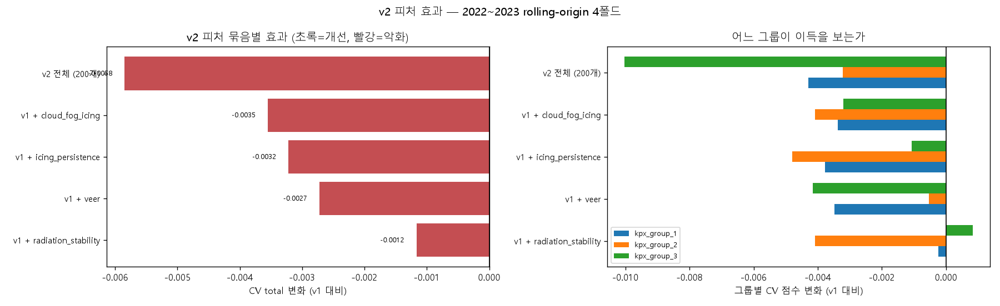

# Phase 4-B. v2 피처 효과 측정 + 그룹 3 전이학습 (`06_feature_ablation.ipynb`)

**결론: 추가한 21개 피처를 전부 버렸고, 그룹 3 전이학습도 채택하지 않았다.**
Phase 4의 설정(v1 179개 피처, 그룹별 τ, `actual` 가중)이 그대로 최선이다. 2024 홀드아웃 **0.6308** 유지.

음성 결과지만 이 Phase에서 얻은 것이 세 가지 있다.

1. **문헌이 권한 피처를 넣었더니 오히려 나빠졌고, 그 이유를 규명했다** (§3-3).
2. **CV 1위를 무조건 따르면 안 된다는 것을 실제로 손해 보며 배웠다** (§4-2). 의사결정 규칙을 고쳤다.
3. **코드 버그를 잡았다.** 파인튜닝이 실행된 적조차 없었다 (§2-4).

---

## 1. 왜 (Why) — 이유와 근거

### 1-1. 미뤄 둔 약속을 지킬 차례

`reports/phase2_features.md` §4-3에 이렇게 적어 두었다.

> **결정 (2026-07-10)**: 추가 피처 후보들을 지금 넣지 않고, 먼저 Phase 3에서 베이스라인 점수를 확보한다.
> **개선 폭을 잴 기준선이 없으면 어떤 피처가 실제로 기여했는지 알 수 없기 때문**이다.

이제 기준선(Phase 4: CV 0.6059 / 2024 홀드아웃 0.6308)이 있고, 4개 폴드짜리 다중 시간 검증도 있다.
약속대로 **하나씩 넣고 재서** 판단한다.

### 1-2. 그룹 3이 병목이다

| 그룹 | 학습 라벨 (2022~23) | 피처당 행 수 | CV 점수 (Phase 4) |
|---|---:|---:|---:|
| kpx_group_1 | 17,422 | 97 | 0.6030 |
| kpx_group_2 | 17,423 | 97 | 0.6456 |
| **kpx_group_3** | **8,760** | **49** | **0.5692** |

그룹 3만 라벨이 2023년부터다. 그런데 세 그룹은 같은 산등성이에 있고 라벨 상관이 0.90~0.93이다.
**그룹 1·2의 17,000시간을 끌어올 수 있다면 데이터가 3배가 된다.**

### 1-3. 실험 설계 — 무엇을 고정했는가

피처의 효과만 보려면 나머지를 전부 고정해야 한다.

| 고정 조건 | 값 | 근거 |
|---|---|---|
| 학습 방식 | `train_on="all"` + **`actual` 표본 가중** | Phase 4 §2-3 절제 실험 1위 |
| 손실 | 분위수, **그룹별 τ = 0.70 / 0.50 / 0.65** | Phase 4 §2-4 |
| 하이퍼파라미터 | Phase 3·4의 기본값 (튜닝 전) | 튜닝과 피처 효과가 섞이지 않게 |
| 검증 | 2022~2023 rolling-origin 4폴드 | Phase 4 §2-2 |
| 홀드아웃 | 2024 — **최종 확인 한 번만** | CLAUDE.md 4번 |

**τ를 고정한 이유**: τ는 이 문제의 가장 큰 지렛대다(+0.03).
피처를 바꾸면서 τ도 같이 바꾸면 **점수가 올라도 무엇 덕분인지 알 수 없다.**

---

## 2. 어떻게 (How) — 과정

### 2-1. v2 피처 21개 생성 (`03_features.ipynb` §8-B)

`reports/phase2_features.md` §4-5에서 도출한 후보를 4개 묶음으로 만들었다.

| 묶음 | 피처 (6/6/6/3개) |
|---|---|
| `icing_persistence` | `icing_cum6h`, `icing_cum12h`, `icing_cum24h`, `icing_incloud_cum12h`, `hours_since_icing`, `melt_potential` |
| `cloud_fog_icing` | `lcc`, `mcc`, `hcc`, `vlcdc`, `icing_flag_lit`, `icing_incloud` |
| `radiation_stability` | `ndnsw`, `ndnlw`, `net_radiation`, `is_daytime`, `gfs_r850`, `t850_minus_thub` |
| `veer` | `ldaps_veer_10_50`, `gfs_veer_10_100`, `gfs_veer_100_850` |

**만들기 전에 원본 컬럼을 직접 재 봤고, 두 가지를 발견했다.**

| 확인 | 결과 | 판단 |
|---|---|---|
| `VLCDC`가 안개 지표인가 | 상대습도 ≥95%일 때 평균 **0.687**, <95%일 때 **0.025** (27배) | 훌륭한 안개·저층운 지표. 채택 |
| GFS `dswrf`가 순간값인가 | **21시(밤)에 115 W/m²** | **평균 플럭스다. 배제** |
| LDAPS `NDNSW`가 순간값인가 | 21시에 **0.0**, 12시에 487 | 순간값. 안정도 피처로 채택 |
| GFS 850hPa가 허브 대체재인가 | 2m 기온과 상관 0.967, RH 상관 0.62 | **대체재 아님. 보조 추정치로만** |

마지막 항목은 **Phase 2 문서의 주장을 정정한 것**이다.
"GFS 격자가 산을 뭉개니 850hPa를 허브 조건으로 쓰라"고 썼는데, **LDAPS는 산을 제대로 잡는다**
(격자 지형고도 868~1,001m ≈ 실제 단지 고도). LDAPS 2m 값은 이미 허브 근처 고도의 값이다.
(`phase2_features.md` §4-5 우선순위 3에 정정 박스를 추가했다.)

### 2-2. v1을 값까지 보존했다

Phase 3·4의 모든 실험이 v1(179개) 위에서 이뤄졌다. v2를 만들며 v1을 건드리면 그 숫자들이 무효가 된다.
그래서 `03_features.ipynb`가 **두 벌을 저장**하고, v1 컬럼의 값이 v2 안에서도 동일한지 `assert`로 강제한다.

| 파일 | 내용 |
|---|---|
| `features_train/test.parquet` | v1 (179개) — Phase 3·4가 읽는 파일 |
| `features_v2_train/test.parquet` | v2 (200개) |
| `feature_manifest.json` | v1 목록, v2 추가분, 묶음 분류 |

### 2-3. 결빙 지속성의 누수 검토 (CLAUDE.md 4번)

누적 착빙은 **train과 test를 시간순으로 이어 붙여** 계산한다. 세 가지를 따졌다.

1. **과거 방향(trailing)만 본다.** `rolling(w)`은 기본이 과거 방향이다. 미래 값을 끌어오지 않는다.
2. **예보값만 쓴다.** 라벨(발전량)이나 SCADA를 전혀 참조하지 않는다.
3. test 첫 시각(2025-01-01 01:00)의 24시간 누적은 **2024-12-31의 예보값**을 참조한다.
   그 예보는 **2024-12-30 13:00에 이미 공개**되었으므로 예측기준시점 이전이다. 사용 가능하다.
   **이어 붙이지 않으면 오히려 test 첫 24시간의 누적값이 틀린다.**

### 2-4. 처음 실행에서 잡은 버그 — 파인튜닝이 실행된 적이 없었다

첫 실행 결과에서 세 설정의 홀드아웃 점수가 **소수점 6자리까지 똑같이** 나왔다.

```
phase4_v1                    0.630751
best_features                0.630751
best_features + g3 (c)       0.630751   ← 파인튜닝을 했다면서 같은 값?
```

코드를 보니 최종 평가에서 `if best_transfer.startswith("(b)")`로 분기해,
**`(b)` 멀티태스크일 때만 특수 경로를 타고 `(c)` 파인튜닝은 조용히 단독 학습으로 떨어지고** 있었다.
CV에서는 `(c)`를 제대로 계산했지만, 최종 모델을 만드는 함수가 아예 없었다.

**고친 것**

- `fit_final_finetune()`을 구현했다 (그룹 1·2로 300그루 사전학습 → `init_model`로 그룹 3 트리를 이어 쌓음).
- 방법 이름 → 최종 학습 함수를 **명시적 딕셔너리로 연결**하고, 누락되면 `assert`로 멈추게 했다.
- **`(a)`와 `(c)`가 실제로 다른 예측을 내는지 코드로 확인**하는 줄을 넣었다
  → `예측이 다른가: True (최대 차이 14,956.4 kWh)`.

> 교훈: "점수가 똑같이 나온다"는 것은 축하할 일이 아니라 **의심할 일**이다.
> 서로 다른 방법이 비트 단위로 같은 답을 내면, 둘 중 하나는 실행되지 않은 것이다.

---

## 3. 결과 (Result)

### 3-1. v2 피처 묶음별 효과 — 전부 나빠졌다

| 설정 | CV total | **Δ vs v1** | g1 | g2 | g3 | 피처 수 |
|---|---:|---:|---:|---:|---:|---:|
| **v1 (기준선)** | **0.6059** | — | 0.6030 | 0.6456 | 0.5692 | 179 |
| v1 + `radiation_stability` | 0.6048 | −0.0012 | 0.6028 | 0.6415 | 0.5700 | 185 |
| v1 + `veer` | 0.6032 | −0.0027 | 0.5995 | 0.6451 | 0.5650 | 182 |
| v1 + `t850_minus_thub` (1개만) | 0.6031 | −0.0028 | 0.6044 | 0.6414 | 0.5635 | 180 |
| v1 + `icing_persistence` | 0.6027 | −0.0032 | 0.5992 | 0.6408 | 0.5681 | 185 |
| v1 + `cloud_fog_icing` | 0.6024 | −0.0035 | 0.5996 | 0.6415 | 0.5660 | 185 |
| v2 전체 (200개) | 0.6001 | **−0.0058** | 0.5987 | 0.6424 | 0.5592 | 200 |



**이 그림에서 읽어야 할 것**: 막대가 전부 왼쪽(빨강)이다. 어느 묶음도 도움이 되지 않았고,
전부 넣으면 가장 나쁘다. 오른쪽 패널을 보면 손해가 세 그룹에 고르게 퍼져 있다.

### 3-2. 이 차이는 잡음인가 — 폴드별 짝비교

CV 평균 하나로 판단하면 안 된다. 폴드가 4개뿐이라 평균 자체가 흔들린다.
같은 (그룹, 폴드) 조합에서 v1과 비교하면 "그 폴드가 원래 쉬웠나"가 상쇄되고 **피처 효과만 남는다.**

| 설정 | 평균 Δ | 표준편차 | 개선된 짝 | 평균/표준오차 |
|---|---:|---:|---:|---:|
| v1 + `radiation_stability` | −0.0013 | 0.0051 | 3/11 | −0.87 |
| v1 + `veer` | −0.0026 | 0.0064 | 5/11 | −1.34 |
| v1 + `icing_persistence` | −0.0034 | 0.0067 | 4/11 | −1.70 |
| v1 + `cloud_fog_icing` | −0.0036 | 0.0046 | 3/11 | **−2.57** |
| v2 전체 | −0.0055 | 0.0063 | 2/11 | **−2.88** |

`|평균/표준오차| > 2`면 우연으로 보기 어렵다(대략 95% 기준).

- **`cloud_fog_icing`과 `v2 전체`의 악화는 통계적으로 유의하다.** 특히 v2 전체는 11개 짝 중 **2개만** 개선됐다.
- 나머지 묶음은 유의하지 않지만 **전부 음수 방향**이고, 개선된 짝도 3~5/11로 절반을 밑돈다.

**어느 쪽으로도 "도움이 된다"는 증거가 없다.** 피처를 늘리면 학습이 느려지고 과적합 위험이 커지므로,
증거가 없으면 **넣지 않는 것이 옳다.**

### 3-3. 왜 나빠졌는가 — 두 가지 진단을 구별했다

CV 점수가 안 오른 원인은 두 가지일 수 있고, **대응이 완전히 다르다.**

| 관측 | 진단 | 대응 |
|---|---|---|
| 모델이 v2 피처를 **거의 안 쓴다** | 정보 자체가 없다 | 버린다 |
| **많이 쓰는데도** 점수가 안 오른다 | 정보가 겹치거나, 피처 수가 늘어 학습을 방해한다("희석") | 골라 넣거나 다르게 쓴다 |

**중요도를 보니 후자에 가깝다.**

| v2 피처 (상위) | gain 중요도 (평균) |
|---|---:|
| `t850_minus_thub` | 0.0186 (**전체 2위**) |
| `gfs_r850` | 0.0098 |
| `icing_cum24h` | 0.0089 |
| `ndnlw` | 0.0085 |
| `gfs_veer_10_100` | 0.0080 |
| … | |
| `icing_flag_lit` | 0.0000 (**아예 안 쓰임**) |

- v2 피처 21개의 중요도 합 **11.47%**. 균등하게 나누면 10.50%이므로 **평균적인 피처만큼은 쓰인다.**
- `t850_minus_thub`(850hPa와 허브의 기온차 = 역전층 강도)는 **전체 200개 중 2위**다.
- 반대로 `icing_flag_lit`(0/1 플래그)은 **중요도 0.0000** — 이진 플래그는 `t_hub_c`와 `rh`로
  트리가 스스로 만들 수 있으므로 새 정보가 없다.

**희석 가설을 직접 검증했다.** `feature_fraction=0.7`이라 트리마다 피처의 70%만 후보로 뽑는다.
쓸모없는 피처가 21개 늘면 좋은 피처가 후보에서 빠질 확률이 커진다.
그래서 **가장 많이 쓰인 v2 피처 하나만** 넣어 봤다.

| | CV Δ | 개선된 짝 | 평균/표준오차 |
|---|---:|---:|---:|
| v1 + `t850_minus_thub` (**1개만**) | **−0.0028** | 4/11 | −1.44 |
| v1 + `radiation_stability` (6개) | −0.0012 | 3/11 | −0.87 |
| v2 전체 (21개) | −0.0058 | 2/11 | −2.88 |

**하나만 넣어도 나빠졌다.** 즉 **희석만이 원인은 아니다.**
`t850_minus_thub`는 모델이 열심히 쓰지만, 그 정보는 이미 `lapse_850_500`(850–500hPa 기온차, 중요도 9위),
`t850_c`, `t_hub_c`, `surface_pressure`로 **v1 안에 들어 있다.**
새 컬럼은 같은 정보를 다른 각도에서 줄 뿐이고, 트리가 그 사이에서 갈팡질팡하며 **분산만 늘린다.**

> 정리: **정보는 있으나 새롭지 않다.** 중요도가 높다는 것은 "유용하다"가 아니라 "자주 선택된다"는 뜻일 뿐이다.
> 서로 겹치는 두 피처는 둘 다 자주 선택되면서 각자의 중요도를 나눠 갖는다.

### 3-4. 겨울에는 결빙 피처가 도움이 된다 (버리기 아까운 신호)

결빙 피처는 **겨울의 일부 시간에만** 작동한다. 1년 평균에 묻힐 수 있으므로 겨울 폴드(2023-01~03)만 따로 봤다.

| 설정 | g1 | g2 |
|---|---:|---:|
| v1 | 0.5840 | 0.6303 |
| **v1 + `icing_persistence`** | **0.5864 (+0.0024)** | **0.6349 (+0.0046)** |
| v1 + `cloud_fog_icing` | 0.5822 (−0.0019) | 0.6323 (+0.0019) |
| v2 전체 | 0.5841 (+0.0001) | 0.6331 (+0.0028) |

(그룹 3은 2023년 1분기에 학습 라벨이 없어 이 폴드를 건너뛴다.)

**`icing_persistence`는 겨울 폴드에서 두 그룹 모두 개선했다.** 설계 의도대로 작동한다는 신호다.
다만 **폴드 하나(3개월)의 점수는 표본이 작아 잡음이 크다.** 이것만으로 채택할 수는 없다.

**다음에 시도할 것**: 계절별로 다른 모델을 쓰거나(겨울 전용 모델), 결빙 피처를 겨울에만 활성화하는 방식.
지금은 근거가 부족하므로 **보류하고 기록만 남긴다.**

### 3-5. 그룹 3 전이학습 — 세 방법 모두 실패

| 방법 | 어떻게 | CV (그룹3, 3폴드) | Δ vs 단독 |
|---|---|---:|---:|
| (a) 단독 학습 | 그룹 3 라벨만 | 0.5692 | — |
| (b) 멀티태스크 | 세 그룹 행을 쌓아 하나의 모델, 타깃은 이용률, 그룹 표시 컬럼 3개 | 0.5677 | **−0.0015** |
| (c) 사전학습+파인튜닝 | 그룹 1·2로 300그루 학습 후 그룹 3 트리를 이어 쌓음 | 0.5696 | **+0.0004** |

**타깃을 이용률(발전량/설비용량)로 바꾼 이유**: 그룹 1·2는 21,600kWh, 그룹 3은 21,000kWh가 만점이다.
kWh 그대로 쌓으면 모델이 "그룹 3은 원래 덜 나온다"를 용량 차이인지 성능 차이인지 구분 못 한다.

**누수 검토**: 그룹 1·2의 라벨을 그룹 3 모델 학습에 쓴다. 이 라벨은 전부 **학습 기간(train)** 의 것이고,
test 기간에는 어느 그룹의 라벨도 없다. 폴드 규칙(검증창 이전 데이터만)도 세 그룹에 똑같이 적용했다.
CLAUDE.md 4번 위반이 아니다.

**(b) 멀티태스크가 나빠진 이유(가설)**: 그룹 3은 **기종이 다르다**(UNISON U136, 로터 136m, 5기 vs VESTAS V126, 126m, 6기).
파워커브 모양과 정격 도달 풍속이 다르다(`phase2_features.md` §3-2: cut-in 2.88 vs 3.62 m/s).
그룹 표시 컬럼 하나로 그 차이를 흡수하기엔 부족하고, 오히려 그룹 1·2의 패턴이 그룹 3을 오염시킨다.

### 3-6. **CV 1위를 따랐다가 손해를 봤다** — 가장 값진 교훈

CV에서 `(c) 파인튜닝`이 +0.0004로 1위였다. Phase 4에서 세운 규칙("최종 설정은 CV 1위를 따른다")대로
그것을 홀드아웃에 적용했다.

| 설정 | CV (g3) | **2024 홀드아웃 total** | 95% 구간 |
|---|---:|---:|---|
| phase4_v1 (그룹3 단독) | 0.5692 | **0.6308** | [0.6257, 0.6353] |
| best_features (= v1) | 0.5692 | 0.6308 | [0.6257, 0.6353] |
| **best + g3 (c) 파인튜닝** | **0.5696 (CV 1위)** | **0.6279** | [0.6227, 0.6324] |

페어드 부트스트랩:

| 비교 | 평균 차이 | 95% 구간 | 판정 |
|---|---:|---|---|
| `best + g3 (c)` − `phase4_v1` | **−0.0028** | **[−0.0053, −0.0004]** | **악화 유의** |

**CV가 +0.0004 좋다고 한 설정이 홀드아웃에서 0.0028 나빴고, 그 악화는 통계적으로 유의하다.**

원인은 명백하다. **+0.0004는 CV 잡음(폴드 표준편차 ≈ 0.005~0.007)보다 한참 작다.**
그런 차이를 신호로 읽고 모델을 바꾼 것이 실수였다.

**의사결정 규칙을 고친다.**

> ~~최종 설정은 CV 1위를 따른다.~~
> **CV 개선이 잡음 폭을 확실히 넘을 때만 설정을 바꾼다. 그렇지 않으면 더 단순한 쪽을 유지한다.**
> (짝비교의 `|평균/표준오차| > 2`, 또는 개선된 짝이 8/11 이상 같은 기준을 함께 본다.)

이 규칙은 Phase 4 §3-3의 발견("상위 세 설정은 부트스트랩상 구별 불가")과 정확히 같은 이야기이며,
그때는 다행히 손해를 안 봤지만 이번에는 실제로 −0.0028을 잃었다.

### 3-7. 실험 로그

`experiments/log.csv`에 exp013~exp015로 기록했다. **실패한 실험도 지우지 않는다** — 같은 실수를 반복하지 않기 위해서다.

| exp_id | model | total_score | note |
|---|---|---:|---|
| exp013 | phase4_v1 | 0.630751 | [CV 0.6059] 기준선 재현 |
| exp014 | best_features | 0.630751 | [CV 0.6059] CV 1위 피처집합 = v1 |
| exp015 | best_features + g3 (c) | 0.627950 | 그룹3 파인튜닝 — **채택 안 함** |

---

## 4. 해석과 다음 단계 (So what)

### 4-1. 최종 결정

| 항목 | 결정 | 근거 |
|---|---|---|
| **피처 집합** | **v1 (179개) 유지** | v2 21개 전부 CV 악화. 하나만 넣어도 악화 (§3-3) |
| **그룹 3 학습** | **단독 학습 유지** | (b) CV 악화, (c) 홀드아웃 유의 악화 (§3-5, §3-6) |
| **최종 설정** | Phase 4의 것 그대로 | 2024 홀드아웃 **0.6308** |

**v2 피처는 삭제하지 않고 `features_v2_*.parquet`로 남겨 둔다.** 계절별 모델(§4-3)에서 다시 쓸 수 있다.

### 4-2. 예상과 달랐던 것

1. **문헌이 권한 피처가 전부 나빴다.** 특히 결빙 지속성은 물리적 근거가 탄탄했는데도 그랬다.
   원인은 "정보가 없어서"가 아니라 **"이미 v1에 들어 있어서"** 다. `month_sin/cos`, `doy_sin/cos`,
   `t_hub_c`, `rh`, `lapse_850_500` 같은 피처가 계절·안정도·습도 정보를 이미 담고 있고,
   트리는 필요하면 그것들을 조합해 결빙 조건을 스스로 만들 수 있다.
2. **중요도가 높은 피처가 도움이 되지 않았다.** `t850_minus_thub`는 전체 2위인데 넣으면 손해다.
   **중요도는 "유용함"이 아니라 "자주 선택됨"을 잰다.** 겹치는 피처는 서로의 중요도를 나눠 가지면서도
   새 정보를 주지 않는다.
3. **CV 1위가 홀드아웃에서 유의하게 나빴다** (§3-6). 잡음을 신호로 읽은 대가다.

### 4-3. 다음 단계

Phase 4 시작 시 세운 순서 중 **5번(피처 추가 + 그룹 3)까지 완료**했다. 남은 것:

1. **Phase 5로 진행** — `train.ipynb` / `inference.ipynb` 분리, 제출 파일 생성·검증, 재현성 최종 확인.
   **첫 제출을 해서 Public 점수와 로컬 2024 점수의 관계를 확인하는 것이 지금 가장 정보량이 크다**
   (CLAUDE.md 5번: 로컬 검증 점수와 Public 점수의 상관을 추적).
2. **계절별 모델 검토** (보류 중인 아이디어). §3-4에서 `icing_persistence`가 겨울 폴드에서
   두 그룹 모두 개선했다. 겨울(12~2월)만 별도 모델을 쓰거나 결빙 피처를 겨울에만 켜는 방식.
   **근거가 폴드 하나뿐이라 지금은 안 한다.** 제출 후 여유가 있으면 4폴드 중 겨울 폴드를 늘려 재검증.
3. **앙상블 — 조심해서.** Phase 3 사전조사에서 단순 평균 앙상블은 FICR을 깎았다(0.6074 → 0.6051).
   평균은 예측을 "평균값"으로 끌어당기는데 우리 산식은 중앙값/최빈값 성향을 원한다.
   묶는다면 **평균이 아니라 중앙값**으로, 또는 앙상블 후 다시 위로 미는 보정과 함께.
4. **TabM 등 딥러닝** — 후순위(`phase3_model_selection.md` §3-4).
   유일하게 설득력 있는 이유는 **미분 가능한 산식 근사를 손실함수로 직접 쓸 수 있다**는 점이다.

### 4-4. 발표 자료에 쓸 것

이 Phase는 **음성 결과지만 발표에서 강한 카드**다. CLAUDE.md 10번의 "한계와 개선 방향"에 해당한다.

- "문헌 기반으로 21개 피처를 설계했으나 **교차검증으로 전부 기각**했다. 중요도는 높았지만 새 정보가 없었다."
- "**CV 1위를 따랐다가 홀드아웃에서 유의하게 손해**를 봤고, 그 뒤 의사결정 규칙을 고쳤다."
- "코드가 **파인튜닝을 한 적이 없다는 것을 점수가 똑같다는 사실로 발견**했다."

세 이야기 모두 **"검증을 제대로 설계했기 때문에 잡을 수 있었던 것들"** 이다.
검증 설계(다중 폴드 + 짝비교 + 부트스트랩)가 이 프로젝트의 핵심 자산임을 보여준다.

### 4-5. 산출물

| 파일 | 내용 | git 추적 |
|---|---|---|
| `03_features.ipynb` | v2 피처 21개 추가 (§8-B), v1/v2 두 벌 저장 | ○ |
| `06_feature_ablation.ipynb` | 이 Phase의 전체 과정 (24셀) | ○ |
| `data/processed/features_v2_*.parquet` | v2 피처 표 | × (`.gitignore`) |
| `data/processed/feature_manifest.json` | v1/v2 컬럼 목록과 묶음 분류 | × (`.gitignore`) |
| `experiments/log.csv` | exp013~exp015 추가 | ○ |
| `reports/figures/phase2b_icing_persistence.png` | 결빙 지속성 피처 동작 확인 | ○ |
| `reports/figures/phase4b_feature_ablation.png` | 묶음별 CV 효과 | ○ |
