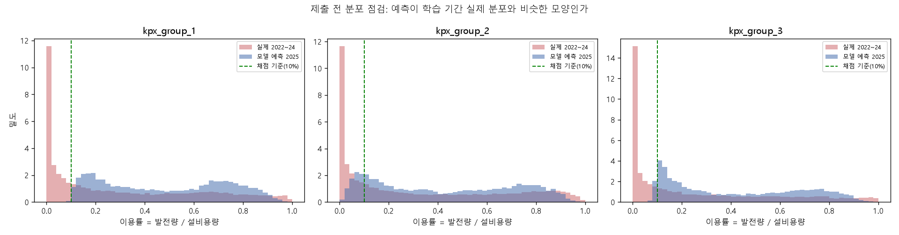

# Phase 5. 최종 모델 · 제출 파이프라인 (`train.ipynb` + `inference.ipynb`)

첫 제출 파일 `submissions/submission_exp016.csv`를 생성하고 검증까지 통과했다.
로컬 2024 홀드아웃 점수 **0.6308** (1−NMAE 0.8636 / FICR 0.3979).

---

## 1. 왜 (Why) — 이유와 근거

### 1-1. 대회 규정이 요구하는 구조

CLAUDE.md 12-3(2차 평가 산출물)은 **학습 코드와 추론 코드를 반드시 별도 파일로 분리**할 것을 요구한다.
산출물 검증에 실패하면 발표평가 자격이 박탈된다.

| 파일 | 하는 일 |
|---|---|
| `train.ipynb` | 피처 parquet 로딩 → 최종 모델 학습 → `models/final/` 저장 |
| `inference.ipynb` | 저장된 모델 로딩 → test 예측 → 제출 파일 생성·검증 |

**전처리 로직이 두 파일에 복사되어 어긋나는 사고**를 막는 방법으로 CLAUDE.md 8번의
**A방식(parquet 경유)** 를 썼다. `01_preprocessing.ipynb` → `03_features.ipynb`가 train과 test를
**완전히 같은 함수**로 처리해 `data/processed/*.parquet`에 저장했고, 두 노트북은 **그 parquet만 읽는다.**
따라서 둘 사이에 전처리 로직이 **존재하지 않으므로 어긋날 수 없다.**

### 1-2. 지금 제출하는 것이 가장 정보량이 큰 행동

1등의 점수 분해가 공개됐다: **1−NMAE 0.87932 / FICR 0.45473 / total 0.66703** (2025 Public).
우리 로컬 2024 점수는 0.6308이다. 그런데 **두 숫자는 다른 해를 본 것이라 직접 뺄 수 없다.**

`phase4_tuning.md` §4-4의 정정에서 확인했듯, 연도 간 난이도 변동 폭이 **최소 0.019**(2023↔2024)이다.
격차 0.036의 절반이나 된다. 즉:

- 연도 오프셋이 +0.019라면 → 실제 격차 0.017 → 오차 **약 7%** 감소로 충분 (앙상블·튜닝 범위)
- 오프셋이 0이라면 → 격차 0.036 → 오차 **약 14%** 감소 필요 (구조적 변화 필요)

**어느 쪽인지 모르면 다음에 무엇을 해야 할지 정할 수 없다.**
제출 한 번이면 이 오프셋을 실측할 수 있다. 그래서 지금 제출한다.

---

## 2. 어떻게 (How) — 과정

### 2-1. 최종 설정과 그 근거

| 항목 | 값 | 근거 |
|---|---|---|
| 모델 | LightGBM (분위수 손실) | `phase3_model_selection.md` — 중소규모 tabular에서 GBDT, Ridge 대비 FICR +0.03 |
| 피처 | **v1 179개** | `phase4b_features_group3.md` — v2 21개는 CV에서 전부 악화 |
| 표본 가중 | **`actual`(실제 발전량)** | `phase4_tuning.md` §2-3 — FICR이 actual 가중이므로 산식과 일치 |
| 분위수 τ | **그룹별 0.70 / 0.50 / 0.65** | `phase4_tuning.md` §2-4 — 산식의 선택편향 보정 |
| 하이퍼파라미터 | Phase 3·4 기본값 (**튜닝 안 씀**) | 아래 §2-2 |
| 학습 기간 | **2022-01-01 ~ 2024-12-31 전체** | 검증이 끝났으므로 가진 라벨을 전부 쓴다 |
| 후처리 | `clip(0, 설비용량)` | CLAUDE.md 5번·7번 |

### 2-2. 왜 Optuna 튜닝 결과를 쓰지 않았나

Phase 4에서 Optuna(설정 C)가 CV 1위(0.6084)였다. 그런데 **페어드 부트스트랩 결과 상위 세 설정(A/B/C)은
통계적으로 구별할 수 없었다** (`phase4_tuning.md` §3-3, 차이의 95% 구간이 모두 0을 포함).

그리고 Phase 4-B에서 **CV 1위를 따랐다가 홀드아웃에서 −0.0028 유의 악화**를 겪었다
(`phase4b_features_group3.md` §3-6). 그 뒤 규칙을 고쳤다.

> **CV 개선이 잡음 폭을 확실히 넘을 때만 설정을 바꾸고, 그렇지 않으면 더 단순한 쪽을 유지한다.**

A(그룹당 분위수 회귀 1개)는 B(분위수 모델 10개 + 결정이론 최적화)나 C(Optuna 탐색)보다
**단순하고 재현·소명 비용이 낮으면서 점수 차이는 증명되지 않았다.** 그래서 A를 골랐다.

### 2-3. 학습 (`train.ipynb`)

**트리 개수를 정하는 방법** (Phase 3·4와 동일한 3단계):

1. 2024-07-01 이전으로 학습하고 **2024년 하반기(내부검증)** 에서 조기 종료 → `best_iter`
2. 학습 데이터가 늘어난 비율만큼 트리 수를 키운다 (`× 전체행수 / 내부학습행수`)
3. 그 개수로 **전체 기간**을 다시 학습

조기 종료 기준은 내부검증 중 **채점 대상 시간(이용률 ≥ 10%)의 손실**이다.
NMAE는 채점 대상만 보므로, 저풍속 시간을 맞히려고 트리를 더 쌓는 낭비를 막는다.

결과:

| 그룹 | τ | 내부검증 최적 | 데이터 비율 | 최종 트리 수 | 학습 행 |
|---|---:|---:|---:|---:|---:|
| kpx_group_1 | 0.70 | 93그루 | ×1.202 | **112** | 26,200 |
| kpx_group_2 | 0.50 | 165그루 | ×1.202 | **198** | 26,201 |
| kpx_group_3 | 0.65 | 82그루 | ×1.336 | **110** | 17,538 |

학습 시간 8.2초.

### 2-4. 저장한 것과 저장한 이유

`models/final/`에 모델 3개(`lgbm_{group}.txt`)와 `config.json`을 저장한다.

**`config.json`에 피처 목록을 순서까지 저장하는 이유**: LightGBM은 컬럼 **이름이 아니라 위치**로 피처를 읽는다.
`inference.ipynb`가 다른 순서의 표를 넣으면 **오류 없이 조용히 엉뚱한 예측을 낸다.**
그래서 추론 때 목록과 대조해 다르면 즉시 멈추게 했다.

모델 파일의 **sha256 해시**도 함께 저장해, 추론이 읽는 파일이 학습이 저장한 그 파일인지 확인한다.
`config.json`에는 라이브러리 버전(Python 3.13.14, LightGBM 4.6.0, OS)과 git 커밋도 기록한다.

### 2-5. 추론과 제출 (`inference.ipynb`)

**이 노트북에서는 어떤 학습도 하지 않는다.** 확인 순서:

1. `config.json`의 sha256과 모델 파일 해시 대조 → 다르면 중단
2. `features_test.parquet`의 피처 이름·순서가 `config.json`과 완전히 같은지 → 다르면 중단
3. 행 수 8,760, 결측·무한대 없음, 시간 정렬·중복 없음
4. **누수 재점검**: `scada_`로 시작하는 컬럼이나 라벨이 test 피처에 없는지
5. 예측 → `clip(0, 설비용량)`
6. `sample_submission.csv`를 그대로 읽어 **예측값 3개 컬럼만 덮어쓰기**
   (시각 매칭은 문자열이 아니라 **datetime 파싱 후 merge** — `src/submission.py`)
7. `validate_submission()`으로 CLAUDE.md 7번 체크리스트 전부 확인

---

## 3. 결과 (Result)

### 3-1. 재현성 검증 (CLAUDE.md 12-3의 핵심 요건)

`train.ipynb`가 **같은 코드를 두 번 돌려 예측값이 비트 단위로 같은지** 스스로 확인한다.

| 그룹 | 두 번 실행 결과 완전 동일 | 최대 차이 | 트리 수 |
|---|---|---:|---|
| kpx_group_1 | True | 0.000e+00 | 112 vs 112 |
| kpx_group_2 | True | 0.000e+00 | 198 vs 198 |
| kpx_group_3 | True | 0.000e+00 | 110 vs 110 |

`deterministic=True`, `force_row_wise=True`, 시드·스레드 수(4) 고정의 결과다.
**"Private Score가 오차 범위 내에서 복원 가능해야 한다"는 요건을 충족한다.**

### 3-2. 제출 파일 검증

`validate_submission()` **문제 0건 통과**.

| 항목 | 결과 |
|---|---|
| 컬럼 순서 | `forecast_id, forecast_kst_dtm, kpx_group_1/2/3` ✔ |
| 행 수 | 8,760 ✔ |
| 시각 형식 | `2025-01-01 01:00:00` ~ `2026-01-01 00:00:00` ✔ |
| `forecast_id`/`forecast_kst_dtm` | sample_submission 원본과 완전 동일 ✔ |
| 결측·음수·용량 초과 | 0건 ✔ |
| 인코딩 | `utf-8-sig`, `index=False` ✔ |

예측값 요약 (kWh):

| 그룹 | 평균 | 최소 | 최대 |
|---|---:|---:|---:|
| kpx_group_1 | 10,420.3 | 2,005.1 | 21,068.3 |
| kpx_group_2 | 9,300.5 | 0.0 | 21,065.3 |
| kpx_group_3 | 8,878.6 | 1,514.9 | 20,678.7 |

### 3-3. 예측 분포 점검 — "위로 치우친 것"이 정상인 이유

| 그룹 | 실제 2022~24 평균 이용률 | 물리예측 2025 평균 | **모델예측 2025 평균** |
|---|---:|---:|---:|
| kpx_group_1 | 0.3066 | 0.3382 | **0.4824** |
| kpx_group_2 | 0.3276 | 0.3818 | **0.4306** |
| kpx_group_3 | 0.2649 | 0.3210 | **0.4228** |

**모델 예측 평균이 실제 평균보다 훨씬 높다.** 처음 보면 "모델이 과대예측한다"고 놀랄 수치다.
**그런데 이것이 설계대로다.** 두 가지가 겹친 결과다.

1. **`actual` 표본 가중**: 저발전 시간의 가중치가 0에 가까워, 모델은 사실상
   **"발전량이 큰 시간"만 학습**한다 (`phase4_tuning.md` §3-4-1: 비채점 시간 37.3%가 가중치의 3.1%).
2. **τ > 0.5**: 채점 대상이 `actual` 기준으로 정해지므로, 추정해야 할 것은
   `E[y | x]`가 아니라 `E[y | x, y ≥ 0.1×용량]`이다 (`phase4_tuning.md` §1-2).

검산이 된다. 2024년 **채점 대상 시간의 평균 실제 발전량**은 그룹 1에서 10,186 kWh = 이용률 **0.47**이었다
(`phase4_tuning.md` §2-5의 `ā`). 우리 모델의 2025년 예측 평균은 **0.48**이다.
**모델은 "모든 시간이 채점 대상이라면 얼마가 나올까"를 예측하고 있다.** 정확히 의도한 바다.

그룹 2는 τ=0.50인데도 평균이 0.43으로 높은데, 이는 **`actual` 가중만으로도 위로 편향된다**는 뜻이다.
τ는 그 위에 얹는 추가 편향이다.

> **왜 벌점이 없나**: 저풍속 시간을 크게 틀려도 그 시간은 `actual` 기준으로 채점 대상이 아니다.
> 산식이 `valid = actual >= capacity * 0.10`으로 걸러낸다. 예측값 기준이 아니다.

### 3-4. 알려진 한계 (2차 평가 소명용)

**피처 중 `pc_pred_*`(파워커브 물리 예측치)와 `ws_hub_cal_*`(풍속 보정식)은 2022~2023년 SCADA로만 학습**되었다
(`phase2_features.md` §2-7). 2024년을 홀드아웃으로 보호하기 위한 조치였다.

최종 모델에서는 2024년 SCADA도 쓸 수 있었지만, 그렇게 하면 features parquet이 바뀌어
**Phase 3·4의 모든 실험 결과가 무효**가 된다. 파워커브는 터빈의 물리적 성질이라 거의 변하지 않으므로
이 선택으로 잃는 것은 작다. (트리 모델은 이 피처를 **입력**으로 쓸 뿐이고, 라벨은 2024년까지 전부 쓴다.)

---

## 4. 해석과 다음 단계 (So what)

### 4-1. 지금 해야 할 일 — 제출하고 오프셋을 잰다

1. `submissions/submission_exp016.csv`를 DACON에 제출한다. **하루 5회 제한이므로 아껴 쓴다.**
2. 받은 Public 점수를 `experiments/log.csv`의 `exp016` 행 `public_score` 칸에 적는다.
3. **`Public − 0.6308`이 연도 오프셋**이다.

이 값이 정해지면 다음이 결정된다 (`phase4_tuning.md` §4-6의 격차 분해).

| 오프셋 | 1등과의 실제 격차 | 필요한 오차 감소 | 실현 가능성 |
|---|---:|---:|---|
| +0.019 (2023↔2024 변동 폭) | 0.017 | ~7% | 앙상블 + 튜닝으로 도달 가능 |
| 0 | 0.036 | ~14% | 구조적 변화 필요 (딥러닝·다중소스 앙상블) |
| 음수 | 0.036 초과 | 14% 초과 | 접근을 근본적으로 재검토 |

**Public 점수에 과적합하지 않는다** (CLAUDE.md 5번). Public은 평가 데이터의 40% 표본이고,
최종 순위는 Private 60%로만 결정된다. Public은 **오프셋을 재는 용도**이지 튜닝 대상이 아니다.

### 4-2. 격차를 메울 후보 (오프셋 확인 후 착수)

`phase4_tuning.md` §4-6에서 확인한 대로, **격차의 83.5%는 정확도(NMAE)** 이고 16.2%만 밴드 기술이다.
우리의 산식-인지 작업은 밴드에서 얻을 것을 이미 대부분 얻었다. **남은 건 순수 정확도다.**

| 후보 | 기대 | 위험 |
|---|---|---|
| **시드 앙상블 (중앙값)** | 분산 감소로 오차 2~5% | 낮음. 단 **평균이 아니라 중앙값**으로 묶어야 한다 |
| **일(day) 단위 블록 피처** | 예보는 하루치 24시간이 한 번에 온다. "그날 전체의 평균/최대 풍속", "이 시각이 그날 중 몇 번째로 센가" 등 아직 안 만든 문맥 피처 | 낮음. v2와 달리 핵심 풍속 정보의 재구성 |
| **NWP 소스별 모델 후 결합** | HREFTC 2024 우승 구조. 두 소스의 편향이 정반대라는 우리 측정과 부합 | 중간 |
| **하이퍼파라미터 재튜닝** | Optuna, 목적=폴드 평균 대회 점수 | 낮음 (이득도 작을 듯) |
| **TabM 등 딥러닝** | 미분 가능한 산식 근사를 손실로 직접 사용 | 높음. 데이터 17.5k행 |

**단순 평균 앙상블은 금지**다. Phase 3 사전조사에서 FICR을 깎았다(0.6074 → 0.6051).
평균은 예측을 "평균값"으로 끌어당기는데 우리 산식은 중앙값/최빈값 성향을 원한다.

### 4-3. 2차 평가 산출물 체크리스트 현황

| 요건 (CLAUDE.md 12-3) | 상태 |
|---|---|
| 학습·추론 코드 분리 | ✔ `train.ipynb` / `inference.ipynb` |
| 공통 로직 공유 (복사 금지) | ✔ A방식(parquet 경유). `src/metric.py`·`src/submission.py`는 import |
| 랜덤 시드 완전 고정 | ✔ seed 42, `deterministic=True`, 스레드 4 고정 |
| 재학습 시 동일 결과 검증 | ✔ `train.ipynb` §6에서 비트 단위 동일 확인 |
| 오류 없이 처음부터 끝까지 실행 | ✔ 모든 노트북 Restart & Run All 통과 |
| UTF-8 인코딩 | ✔ 코드·주석·제출 파일(`utf-8-sig`) |
| `requirements.txt` 버전 고정 | ✔ `pip freeze` 기반 69개 |
| OS·Python 버전 기재 | ✔ `models/final/config.json`의 `versions` |
| 발표 자료 PDF (10분) | ✘ **아직** — Phase 5 후반 작업 |
| 누수 소명 1장 | ✘ **아직** — 재료는 `reports/`에 충분 |

---

## 5. 제출 결과 (2026-07-11) — 연도 오프셋과 격차 재분해

### 5-1. Public 점수

| | 로컬 2024 홀드아웃 | **Public 2025** | 차이 |
|---|---:|---:|---:|
| 1−NMAE | 0.8636 | **0.8493** | **−0.0143** |
| FICR | 0.3979 | **0.39637** | **−0.0015** |
| total | 0.6308 | **0.62284** | **−0.0080** |

**연도 오프셋은 −0.0080이다.** 2025년은 우리에게 더 어려운 해였다.
`phase4_tuning.md` §4-4에서 "2025는 쉬운 해"라고 추정했다가 정정한 판단이 옳았고, 실제로는 약간 더 어려웠다.

### 5-2. 가장 중요한 발견 — 손실은 전부 NMAE의 "꼬리"에서 왔다

**FICR은 사실상 완벽하게 전이됐고(−0.0015), NMAE만 무너졌다(−0.0143).**

이것은 우연이 아니다. 두 지표의 구조가 다르다.

| 지표 | 큰 오차에 대한 반응 |
|---|---|
| **FICR** | 오차율 8%를 넘으면 9%든 50%든 **똑같이 0점**. 꼬리에 **둔감**하다 |
| **NMAE** | 오차가 커진 만큼 그대로 반영. 꼬리에 **완전히 노출**된다 |

따라서 **2025년에서 우리가 잃은 것은 "이미 밴드 밖이던 큰 오차가 더 커진 것"** 이다.
밴드 안쪽(핵심 구간)의 성능은 그대로 옮겨갔다.

### 5-3. 1등과의 격차 재분해 — 어제의 계산이 틀렸다

`phase4_tuning.md` §4-6에서 "격차의 83.5%가 정확도"라고 계산했다.
그것은 **2024년 오차 분포로 만든 반사실**(오차를 균일 축소하면 FICR이 이렇게 오른다)이었다.
이제 **같은 데이터(2025 Public) 위의 실제 숫자**가 있다.

| | 우리 Public | 1등 Public | 차이 | total 기여 |
|---|---:|---:|---:|---:|
| 1−NMAE | 0.8493 | 0.87932 | −0.0300 | 0.0150 (34%) |
| FICR | 0.39637 | 0.45473 | **−0.0584** | **0.0292 (66%)** |
| total | 0.62284 | 0.66703 | −0.04419 | |

**같은 데이터에서 재면 FICR 격차가 66%다.** 반사실이 틀린 이유는
"FICR = f(NMAE)"라는 관계가 **연도를 넘어 성립하지 않기 때문**이다.

- 우리 2024: NMAE 0.1364 → FICR 0.3980
- 우리 2025: NMAE 0.1507 → FICR 0.3964 (NMAE가 훨씬 나쁜데 FICR은 거의 같다)

> **교훈**: 라벨이 없는 기간의 성능을 반사실로 추정하지 말 것. **한 번 제출하면 알 수 있다.**

그리고 1등은 우리보다 **NMAE도 좋고 FICR은 훨씬 좋다.**
우리 트레이드오프 곡선(τ를 올리면 FICR↑ NMAE↓) 위의 어떤 점도 아니다. **그냥 더 좋은 모델이다.**

### 5-4. 격차를 메우려 시도했다가 기각한 것 (전부 다중 폴드 CV로 측정)

Public 결과를 받은 뒤, 값싼 수단을 순서대로 전부 시험했다. **일곱 개 전부 실패했다.**

| 시도 | CV Δ vs v1 | 개선된 짝 | 평균/표준오차 | 판정 |
|---|---:|---:|---:|---|
| 시드 5개 평균 앙상블 | −0.0010 | – | – | 기각 |
| 시드 5개 중앙값 앙상블 | −0.0008 | – | – | 기각 |
| 학습률 0.02 + 트리 472그루 | −0.0020 | – | – | 기각 |
| 전 격자 허브고도 풍속 추가 (+25) | −0.0026 | 2/11 | −1.61 | 기각 |
| **원시 NWP 800컬럼 추가** | −0.0050 | 2/11 | **−2.17** | 기각 (유의) |
| **원시 800컬럼만 사용** | −0.0116 | 1/11 | **−3.60** | 기각 (유의) |
| 하루치 블록 문맥 피처 (+29) | −0.0023 | 5/11 | −1.12 | 기각 |
| 예측값 3시간 이동평균 | −0.0001 | 5/11 | −0.16 | 기각 (완전 잡음) |

**중요한 반증 하나**: HREFTC 2024 우승팀이 "NWP 격자점 raw"를 썼다는 점에 근거해
**"우리 피처 엔지니어링이 공간 정보를 버렸다"** 는 가설을 세웠다.
직접 재 보니 **원시 800컬럼만 쓰면 −0.0116 (유의하게 악화)** 다.
**우리의 179개 피처는 원시값보다 확실히 낫다.** 가설이 깨끗하게 기각됐다.

또한 트리를 472그루까지 늘려도 나아지지 않았으므로 **조기 종료가 일찍 끊은 것이 아니다.**
분산 감소로 짜낼 여지는 없다. **남은 것은 정보나 모델 구조의 문제다.**

### 5-5. 다음에 시험할 것 — Public 분해가 가리키는 방향

손실이 전부 **NMAE의 꼬리**에서 왔다는 사실이 단서다.
Phase 4의 **설정 B(결정이론적 점예측)** 의 성질을 다시 보자.

$$ g(\hat y) = -\,\mathbb{E}|\hat y - a| \;+\; k\cdot\mathbb{E}\big[a\cdot\text{price}(|\hat y - a|/u)\big] $$

- **예측 불확실성이 큰 시각**: 어떤 `ŷ`도 6% 밴드에 들어갈 확률이 낮아 둘째 항이 평평해진다.
  → 첫째 항만 남아 **`ŷ` = 조건부 중앙값**. **NMAE를 지킨다.**
- **확신이 있는 시각**: 둘째 항이 지배한다. → **밴드 중심**을 노린다. **FICR을 확보한다.**

**즉 B는 시각마다 "중앙값 모드"와 "밴드 모드"를 자동 전환한다.**
반면 A(고정 τ)는 **모든 시각을 똑같이 위로 밀어 올린다.** 정확히 불확실한 시각에서 NMAE를 잃는다.

Phase 4 홀드아웃 표(§3-1)에 이미 그 신호가 있었다.

| 설정 | 1−NMAE | FICR |
|---|---:|---:|
| A (고정 τ) | 0.8636 | 0.3979 |
| **B (결정이론)** | **0.8653** | 0.3977 |

**B가 NMAE에서 앞서고 FICR은 같다.** 2024년에서는 차이가 미미해 "구별 불가"로 판정하고 단순한 A를 골랐다.
그런데 **2025년은 꼬리가 두꺼운 해**였고, B의 장점이 바로 그 꼬리를 보호하는 것이다.

이번에는 CV 총점이 아니라 **NMAE와 FICR을 따로 보고** B를 재평가했다.
(총점만 보면 두 성분의 변화가 상쇄돼 보이지 않는다.)

### 5-6. B 재평가 결과 — 메커니즘은 맞았지만 교환비가 불리하다

| 설정 | CV total | 1−NMAE | FICR | A 대비 total | A 대비 1−NMAE | A 대비 FICR |
|---|---:|---:|---:|---:|---:|---:|
| A: 고정 τ (현재 제출) | 0.6059 | 0.8517 | 0.3601 | — | — | — |
| B10: 분위수 10개 | 0.6056 | 0.8531 | 0.3581 | −0.0003 | **+0.0014** | −0.0020 |
| B20: 분위수 20개 | 0.6053 | 0.8539 | 0.3568 | −0.0006 | **+0.0022** | −0.0034 |

**예측한 메커니즘이 정확히 확인됐다.** B는 NMAE를 지키고 FICR을 내준다.
분위수 원자를 10개 → 20개로 늘리면 그 경향이 더 강해진다(불확실성 추정이 정밀해질수록 중앙값 모드가 자주 켜진다).

**그런데 잃는 FICR이 얻는 NMAE보다 크다.** 산식이 둘을 0.5씩 가중하므로 총점은 제자리다.
2025년의 두꺼운 꼬리에서 교환비가 뒤집힐 가능성은 있지만, **그것은 추측이고 검증할 방법이 없다.**
(Public으로 튜닝하는 것은 CLAUDE.md 5번 위반이며, 1개 표본으로는 판단할 수도 없다.)

### 5-7. 결정적 사실 — 트레이드오프 곡선 위에는 답이 없다

지금까지 확인한 우리 모델의 (1−NMAE, FICR) 좌표들:

| 설정 | 1−NMAE | FICR |
|---|---:|---:|
| Phase 3 L1 (2024 홀드아웃) | 0.8688 | 0.3459 |
| A 고정 τ (2024 홀드아웃) | 0.8636 | 0.3979 |
| B 결정이론 (2024 홀드아웃) | 0.8653 | 0.3977 |
| A 고정 τ (**2025 Public**) | 0.8493 | 0.39637 |
| **1등 (2025 Public)** | **0.87932** | **0.45473** |

**1등은 두 축 모두에서 우리보다 앞선다.** τ를 올리든 내리든, A에서 B로 바꾸든,
우리는 **같은 곡선 위를 미끄러질 뿐**이다. 곡선 자체를 바깥으로 밀어내지 않으면 도달할 수 없다.

곡선을 밀어내는 방법은 하나뿐이다: **같은 입력에서 더 좁은 조건부 분포를 만드는 것.**
즉 예측을 참값 주위로 더 촘촘히 모으는 것이고, 그것이 "더 좋은 모델"의 정의다.

그런데 §5-4에서 확인했듯 **정보를 늘리는 시도(피처 추가, 원시 격자, 하루블록)와
분산을 줄이는 시도(앙상블, 트리 수)가 전부 실패했다.**

**남은 유일한 구조적 수단**: `0.5·(1−NMAE) + 0.5·FICR`을 **미분 가능한 근사로 바꿔 직접 최적화**하는 것.
FICR의 계단 함수를 시그모이드로 부드럽게 만들면 신경망은 그것을 손실로 쓸 수 있다.
GBDT는 헤시안이 필요해 계단 근사를 다루기 까다롭다(`phase3_model_selection.md` §3-4에서
딥러닝을 시도할 "유일하게 설득력 있는 이유"로 이미 지목한 바 있다).

**왜 이것만이 두 축을 동시에 밀 수 있는가**: 우리가 지금까지 한 모든 것은
**먼저 예측 오차를 줄이고(손실 L1/분위수), 그 다음 산식에 맞게 후처리·편향**하는 2단계였다.
산식을 직접 최적화하면 모델이 **"어느 시각에 얼마나 밴드를 노리고, 어느 시각에 안전하게 갈지"를
가중치 학습 단계에서** 정한다. B가 추론 시점에 하는 일을 학습 시점에 하는 셈이다.

---

## 6. 산출물

| 파일 | 내용 | git 추적 |
|---|---|---|
| `train.ipynb` | 최종 학습 (15셀) | ○ |
| `inference.ipynb` | 추론·제출 (17셀) | ○ |
| `models/final/lgbm_kpx_group_*.txt` | LightGBM 부스터 3개 (총 2.9MB) | ○ |
| `models/final/config.json` | 피처 목록·순서, τ, 시드, 해시, 버전 | ○ |
| `submissions/submission_exp016.csv` | 제출 파일 (776KB, 8,760행) | ○ |
| `experiments/log.csv` | exp016 추가 (`public_score` 공란) | ○ |
| `reports/figures/phase5_prediction_distribution.png` | 예측 분포 점검 | ○ |
| `requirements.txt` | optuna 4.9.0 추가 → 69개 | ○ |
